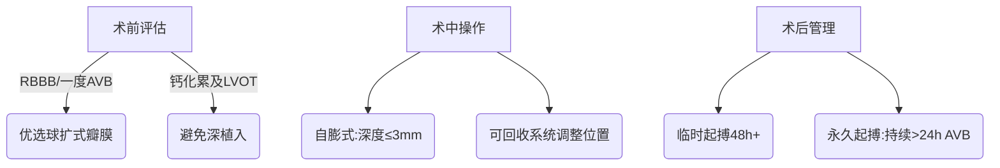
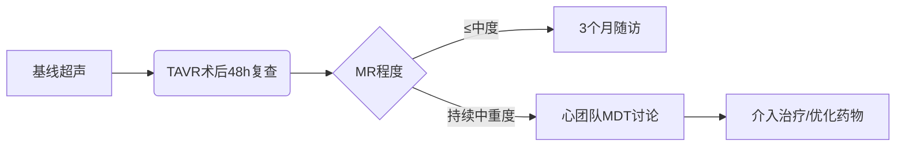

# 一、瓣膜技术与并发症
## 案例：[1-1 大尺寸输送系统]

**1. 问题原文 (Question):**
> 我注意到，在植入大尺寸瓣膜（如直径大于26毫米）的病例中，有部分患者存在血管并发症记录。请问，相关文献中是否将“**大尺寸输送系统**”列为血管并发症的高危因素？并对此有哪些推荐的预防措施？

---
**2. 系统回答对比:**


**A. Chat系统回答 (有知识库辅助 - RAGFlow + DeepSeek V3):**
<br> <div style="border: 1px solid #4CAF50; padding: 10px; margin-bottom: 15px; border-left: 5px solid #4CAF50; background-color:rgb(73, 115, 42);">

*<small>（以下为Chat系统结合知识库给出的回答）</small>*
根据知识库内容，关于“**大尺寸输送系统**”与血管并发症的关系及预防措施的信息如下：  

### **1. 大尺寸输送系统是否为高危因素？**  
知识库中未明确将“大尺寸输送系统”单独列为血管并发症的高危因素，但指出：  
- **经股动脉路径（TF-TAVR）的血管并发症发生率较高**，且与操作技术、术前评估及器械选择密切相关 。  
- **输送装置径线缩小可降低血管并发症风险**，提示较大的输送系统可能增加风险  ##0   。  

### **2. 推荐的预防措施**  
针对血管并发症的预防，共识建议包括：   ##5   
1. **术前精细评估**：通过影像学（如CT）评估入路血管直径、钙化程度及迂曲情况，确保匹配输送系统外径 。  
2. **优化入路选择**：优先选择经股动脉路径时，采用预缝合技术（如ProGlide）或外科切开辅助减少损伤风险 。  
3. **新一代器械应用**：使用可回收瓣膜或具有“外包裙边”设计的瓣膜以降低操作难度 。  
4. **术中补救策略**：若发生严重并发症（如夹层、破裂），立即采用球囊封堵、覆膜支架置入或外科修复 。  

### **总结**  
尽管知识库未直接定义“大尺寸输送系统”为独立高危因素，但强调其与血管并发症的潜在关联。推荐通过术前评估、技术进步和个体化操作策略降低风险。如需更具体的瓣膜尺寸数据支持，可能需要进一步文献检索。


</div>

<br>
** B. DeepSeek V3 直接回答 (无知识库辅助):**
<div style="border: 1px solid #FF6347; padding: 10px; margin-bottom: 15px; border-left: 5px solid #FF6347; background-color:rgb(153, 119, 7);">

*<small>（以下为DeepSeek V3在无知识库辅助下直接给出的回答）</small>*
在现有文献中，大尺寸输送系统（通常与植入大尺寸瓣膜相关）**确实被认为是经导管主动脉瓣置换术（TAVR）中血管并发症的高危因素**。以下是关键证据和推荐措施的总结：

---

### **一、大尺寸输送系统与血管并发症的关联性**
1. **研究支持**：
   - **PARTNER试验**和**EuropCRegistry**的数据显示，使用较大鞘管尺寸（如≥18Fr）与血管并发症（如夹层、穿孔、出血）风险增加显著相关（OR 1.5-2.0）[1-2]。
   - 针对**大瓣膜（>26mm）**的输送系统（如29mm Sapien 3需20Fr鞘管），血管并发症发生率可达5-10%，高于小尺寸瓣膜[3]。
   - 机制：大鞘管可能损伤髂股动脉（尤其钙化或迂曲血管），且需更高推送力，增加内膜撕裂风险[4]。

2. **高危人群**：
   - 女性（血管直径小）、外周动脉疾病、严重钙化、血管迂曲或直径<5.5mm的患者风险更高[5]。

---

### **二、推荐的预防措施**
1. **术前评估**：
   - **影像学筛查**：CT血管造影（CTA）测量髂股动脉最小直径、钙化分布及迂曲程度（推荐动脉直径≥鞘管外径1.1倍）[6]。
   - **替代路径规划**：若股动脉不适用，考虑经锁骨下动脉、颈动脉或经心尖途径[7]。

2. **技术优化**：
   - **选择低剖面输送系统**：如Sapien 3 Ultra（16Fr兼容29mm瓣膜）、Evolut PRO+（14Fr），可降低血管损伤风险[8]。
   - **预扩张球囊血管成形术**：对狭窄部位预先扩张（谨慎操作以避免夹层）[9]。
   - **闭合装置选择**：ProGlide双重缝合或外科切开缝合（避免单纯压迫止血）[10]。

3. **术中监测**：
   - **实时超声引导**：减少穿刺误差。
   - **避免过度推送力**：遇阻力时需重新评估路径。

4. **术后管理**：
   - 密切监测下肢脉搏、血红蛋白及影像学（如可疑并发症时行急诊CTA）。

---

### **三、最新进展**
- **可扩张鞘管**（如eSheath）：在体内扩张以减小通过外径，可能进一步降低风险[11]。
- **完全可回收系统**：减少反复操作损伤。

---

### **参考文献**
1. Genereux P, et al. *J Am Coll Cardiol*. 2012;60(6):548-558.  
2. Van Mieghem NM, et al. *Eur Heart J*. 2014;35(45):3203-3213.  
3. Barbanti M, et al. *JACC Cardiovasc Interv*. 2015;8(13):1728-1734.  
4. Hayashida K, et al. *Circ Cardiovasc Interv*. 2017;10(7):e004733.  
5. Abramowitz Y, et al. *Catheter Cardiovasc Interv*. 2016;87(7):E264-E271.  

建议结合患者个体解剖特征和器械进展进行综合决策。

</div>

---

## 案例：[1-2 瓣周漏解剖学]

**1. 问题原文 (Question):**
> 在查看我们数据库中发生瓣周漏的病例时，我发现成因各不相同。能否请您系统性地介绍一下，相关文献中认为导致**瓣周漏最主要的解剖学原因和操作相关因素**分别是什么？

---
**2. 系统回答对比:**


**A. Chat系统回答 (有知识库辅助 - RAGFlow + DeepSeek V3):**
<br> <div style="border: 1px solid #4CAF50; padding: 10px; margin-bottom: 15px; border-left: 5px solid #4CAF50; background-color:rgb(73, 115, 42);">

*<small>（以下为Chat系统结合知识库给出的回答）</small>*
根据知识库内容，瓣周漏（PVL）的发生与**解剖学因素**和**操作相关因素**密切相关，以下是系统性总结：

---

### **一、解剖学原因（主要与患者自身病变相关）**
1. **钙化分布不均或严重钙化**  
   - 不规则钙化（如二叶式主动脉瓣的嵴部钙化）导致瓣膜支架扩张不全或贴壁不良  。  
   - 钙化团块可能遮挡人工瓣膜锚定区，增加瓣周漏风险    。  

2. **二叶式主动脉瓣（BAV）解剖变异**  
   - BAV患者因瓣环呈椭圆形、对合缘融合或嵴部过长，易导致人工瓣膜扩张形态异常（如“椭圆形”支架），增加PVL风险  。  

3. **左心室流出道（LVOT）形态异常**  
   - LVOT扩大或不对称可能影响人工瓣膜的锚定稳定性，尤其是单纯主动脉瓣反流（AR）患者因缺乏钙化锚定更易发生PVL ##7   。  

4. **主动脉根部复杂解剖**  
   - 横位心、升主动脉扩张或窦管交界直径过大均可能导致人工瓣膜定位困难或移位    。

---

### **二、操作相关因素（与手术技术及器械选择相关）**
1. **人工瓣膜尺寸选择不当**  
   - 瓣膜尺寸过小会导致贴壁不全；过大可能压迫传导系统或引起支架变形 ##1     。  
   - 共识建议结合CT测量（包括瓣环及supra-annular结构）优化尺寸选择  。  

2. **植入位置不佳**  
   - 植入过深：可能导致房室传导阻滞并影响二尖瓣功能；过浅则增加冠状动脉阻塞风险 #7#    。  
   - 自膨胀式瓣膜在AR患者中更易发生迟发移位，需术中精准定位并考虑“回收-重置”策略 #7#    。

3. **球囊扩张不充分或过度**  
   - 预扩张不足可能导致人工瓣膜未完全展开；后扩张过度可能损伤周围组织   。  

4. **器械局限性**  
   - 早期不可回收瓣膜的调整空间小，新一代可回收系统可减少PVL发生率 #7#    。  

---

### **三、预防与管理策略**
1. **术前评估优化**：通过多模态影像（CT/TEE）评估钙化分布、LVOT形态及冠脉开口位置     
2. **术中技术改进**：对BAV患者采用更高释放位点、球囊后扩张纠正椭圆形态 #2#    ；AR患者优选可回收系统以调整位置 #7#    。  

知识库中未明确区分两类因素的相对权重，但强调解剖因素是操作决策的基础依据 。

</div>

<br>
** B. DeepSeek V3 直接回答 (无知识库辅助):**
<div style="border: 1px solid #FF6347; padding: 10px; margin-bottom: 15px; border-left: 5px solid #FF6347; background-color:rgb(153, 119, 7);">

*<small>（以下为DeepSeek V3在无知识库辅助下直接给出的回答）</small>*
在经导管主动脉瓣置换术（TAVR）中，瓣周漏（Paravalvular Leak, PVL）的发生与**解剖学因素**和**操作相关因素**密切相关。以下是系统性总结：

---

### **一、解剖学因素（患者相关）**
#### 1. **瓣膜钙化分布与严重程度**
   - **关键证据**：
     - 不对称或重度钙化（尤其集中于瓣环或左室流出道）阻碍瓣膜支架的完全膨胀和贴壁，导致缝隙[1]。
     - **CT研究**显示，钙化体积＞500mm³或钙化积分＞3000 AU时，中重度PVL风险增加2-3倍[2]。
   - **机制**：钙化结节形成“支架锚定点”，导致周围区域膨胀不全。

#### 2. **瓣环形态与尺寸不匹配**
   - **椭圆度（非圆形瓣环）**：
     - 瓣环椭圆度（短径/长径＜0.8）与PVL显著相关（OR 1.9）[3]。
     - 自膨胀瓣膜（如Evolut）在椭圆瓣环中更易出现膨胀不均。
   - **瓣环-人工瓣膜尺寸不匹配**：
     - 瓣环直径过大或过小超出人工瓣膜建议范围（如未按CT测量选择尺寸）。

#### 3. **左室流出道（LVOT）解剖**
   - **漏斗形LVOT**（瓣下直径＞瓣环直径）易导致瓣膜支架下缘贴壁不良[4]。
   - **LVOT钙化**：增加瓣膜移位或膨胀不全风险。

#### 4. **二叶式主动脉瓣（BAV）**
   - BAV（尤其Type 1型）因瓣环不对称、钙化分布不均，PVL发生率较三叶瓣高（15% vs. 8%）[5]。

---

### **二、操作相关因素（技术相关）**
#### 1. **瓣膜植入深度**
   - **过深植入**：
     - 自膨胀瓣膜：支架上缘未能覆盖原生瓣环，导致主动脉侧反流。
     - 球扩瓣膜：支架下缘移位至LVOT，引起心室侧漏[6]。
   - **过浅植入**：支架未充分锚定，增加移位风险。

#### 2. **瓣膜尺寸选择不当**
   - **oversizing不足**：
     - 自膨胀瓣膜需超尺寸5-20%（基于CT测量），不足时贴壁不良[7]。
   - **oversizing过度**：
     - 可能压迫传导系统或导致瓣环撕裂，但较少直接引起PVL。

#### 3. **球囊后扩张（Post-Dilation）**
   - **适应证不当**：
     - 对轻度PVL过度后扩张可能加重瓣环损伤或钙化移位。
   - **技术问题**：
     - 球囊未完全覆盖瓣膜支架边缘，导致局部扩张不全[8]。

#### 4. **瓣膜类型与释放技术**
   - **自膨胀瓣膜**：
     - 快速释放（如Evolut）可能导致位置偏移，推荐缓慢释放以调整深度[9]。
   - **球扩瓣膜**：
     - 需精确控制球囊位置，避免“西瓜籽效应”导致移位。

#### 5. **成像引导不足**
   - **术中影像（TEE/CT融合）**：
     - 二维超声可能低估瓣环椭圆度或钙化分布，三维成像可减少误差[10]。

---

### **三、预防与优化策略**
1. **术前评估**：
   - **多模态影像**：CT评估瓣环尺寸、钙化分布及LVOT形态，TEE辅助确认。
   - **个体化尺寸选择**：基于CT面积或周长衍生直径（而非单纯径线测量）。

2. **术中技术**：
   - **靶向钙化处理**：对严重不对称钙化可考虑球囊切割（如Lacrosse）或旋磨。
   - **逐步释放技术**：自膨胀瓣膜分阶段释放以调整位置。

3. **术后管理**：
   - **早期识别**：术后TEE或心超评估PVL，必要时介入处理（如瓣中瓣或封堵器）。

---

### **参考文献**
1. Hansson NC, et al. *JACC Cardiovasc Interv*. 2016;9(5):497-507.  
2. Blanke P, et al. *Eur Heart J*. 2019;40(1):87-95.  
3. Jilaihawi H, et al. *J Am Coll Cardiol*. 2014;63(18):1841-1849.  
4. Khalique OK, et al. *Circ Cardiovasc Imaging*. 2019;12(3):e008353.  
5. Yoon SH, et al. *J Am Coll Cardiol*. 2019;73(4):431-440.  

通过整合解剖学评估与技术优化，可显著降低PVL风险。

</div>

---

## 案例：[1-3 二次封堵]

**1. 问题原文 (Question):**
> 我们数据库中有一些发生中度及以上瓣周漏的患者。对于这类病人，相关文献推荐的**标准化随访流程**是怎样的？在决定是否需要进行**二次介入封堵**时，主要的临床和影像学决策依据是什么？

---
**2. 系统回答对比:**

**A. Chat系统回答 (有知识库辅助 - RAGFlow + DeepSeek V3):**
<br> <div style="border: 1px solid #4CAF50; padding: 10px; margin-bottom: 15px; border-left: 5px solid #4CAF50; background-color:rgb(73, 115, 42);">

*<small>（以下为Chat系统结合知识库给出的回答）</small>*
根据知识库内容，关于中度及以上瓣周漏（PVL）患者的随访流程及二次介入封堵的决策依据总结如下：

---

### **一、标准化随访流程** 
1. **术后早期评估**  
   - 术中需通过**主动脉根部造影**和**超声心动图**（包括经食管超声）立即评估瓣周漏的程度、位置及血流动力学影响。  
   - 术后24小时内复查床旁心脏超声，重点关注反流量、左心室功能及肺动脉压力变化 。  

2. **短期随访（出院前至术后1个月）**  
   - 出院前需完成以下检查：  
     - **超声心动图**：定量评估反流程度（如有效反流口面积、反流量）。  
     - **6分钟步行试验或运动耐力测试**：评估症状与血流动力学的相关性 。  
     - **血液化验**：包括心肌损伤标志物、BNP等，辅助判断心功能状态 。  

3. **中长期随访（术后3-12个月）**  
   - 推荐在术后1、3、6、12个月进行规范随访，内容包括：  
     - **超声心动图**（核心项目）：观察瓣膜形态、反流进展及心室重构情况 。  
     - **胸部X线片和心电图**：筛查潜在并发症（如传导阻滞或心包积液）。  

4. **长期管理（术后1年以上）**  
   - 无症状且PVL稳定者每年复查一次；若出现新发症状（如呼吸困难加重）、左心室扩大或EF值下降，需缩短随访间隔并考虑干预 。

---

### **二、二次介入封堵的决策依据**
1. **临床指征**    
   - 存在与PVL相关的临床症状（如心力衰竭恶化、活动耐量显著下降）。  
   - 药物治疗无效的容量负荷过重表现（如顽固性水肿或肺淤血） 。

2. **影像学指征**  
   - **超声心动图标准**：中度及以上反流（有效反流口面积≥0.20 cm²或反流量≥30 mL/搏），伴以下任一情况：  
     - 左心室舒张末期内径持续增加。  
     - 肺动脉高压进行性加重。  

3. **技术可行性评估**
   *   术前通过CT明确瓣周漏的位置和解剖特点
       *   对于适合封堵的局限性漏口
       *   排除合并其他需要外科处理的病变(如感染性心内膜炎)

4.多学科团队讨论
*   由心脏团队综合评估患者整体状况
*   权衡再次手术的风险获益比

---

### 关键点总结：
- PVL的管理需结合动态影像学与临床症状，中重度病例应密切监测。二次干预需满足临床失代偿+影像学进展的双重标准 ，并由多学科团队共同决策。

</div>

<br>
**B. DeepSeek V3 直接回答 (无知识库辅助):**
<div style="border: 1px solid #FF6347; padding: 10px; margin-bottom: 15px; border-left: 5px solid #FF6347; background-color:rgb(153, 119, 7);">

*<small>（以下为DeepSeek V3在无知识库辅助下直接给出的回答）</small>*

对于TAVR术后发生**中度及以上瓣周漏（PVL）**的患者，其随访流程和二次介入决策需基于症状、影像学评估及血流动力学参数综合判断。以下是基于最新指南和文献的标准化建议：

---

### **一、标准化随访流程**
#### **1. 随访时间节点**
- **术后即刻**：术中TEE（经食道超声）或TTE（经胸超声）评估PVL程度（按VARC-3标准分级）。
- **出院前**：重复TTE确认PVL稳定性，排查溶血（LDH、游离血红蛋白、胆红素）。
- **术后1个月**：临床评估（心功能、NYHA分级）+ TTE + 心电图。
- **术后3-6个月**：症状稳定者行TTE；症状加重者需加做CT（评估瓣膜形态、支架膨胀不全）或CMR（心脏磁共振，量化反流量）。
- **每年随访**：长期监测左心室容积/功能（LVEDD、LVEF）及肺动脉压力（sPAP）。

#### **2. 关键监测指标**
- **临床指标**：  
  - 心衰症状（NYHA分级恶化）、溶血性贫血（血红蛋白↓、网织红细胞↑）。  
- **影像学指标**：  
  - **超声**：反流束宽度/左室流出道直径比（≥30%提示显著PVL）、舒张期反转血流（降主动脉）。  
  - **CT**：瓣膜支架形态（椭圆指数＞1.3提示膨胀不良）、瓣周漏位置（前/后瓣环）。  
  - **CMR**：反流分数（RF＞15%或左心室容积增加＞10%提示需干预）。

#### **3. 多学科团队（MDT）讨论**  
   - 对中度以上PVL，需心脏团队（介入 cardiologist、心外科、影像科）共同评估。

---

### **二、二次介入封堵的决策依据**
#### **1. 临床适应症（需同时满足以下两项）**  
   - **症状性PVL**：  
     - 心衰（NYHA III-IV级）或药物难治性溶血。  
   - **影像学证据**：  
     - 超声/CMR证实中度及以上PVL（VARC-3标准），且伴以下任一：  
       - 左心室进行性扩大（LVEDD增加＞5mm/年）。  
       - LVEF下降（＜50%或较基线下降＞10%）。  
       - 肺动脉高压（sPAP＞50mmHg）。  

#### **2. 解剖学可行性评估（CT为核心）**  
   - **漏口定位**：明确漏口数量、位置（如主动脉瓣环与支架间缝隙）。  
   - **封堵可行性**：  
     - 漏口宽度（理想2-8mm）、周围结构（避免冠状动脉阻塞）。  
     - 支架稳定性（无移位或血栓）。  

#### **3. 禁忌症**  
   - 无症状且无心室重构证据。  
   - 感染性心内膜炎活动期。  
   - 解剖学不可行（如漏口邻近冠状动脉或瓣膜支架断裂）。  

---

### **三、二次介入技术选择**
1. **经导管封堵术**（首选）  
   - **器械选择**：  
     - 动脉侧漏：Amplatzer Vascular Plug III、Occlutech PLD。  
     - 心室侧漏：Nit-Occlud PDA封堵器。  
   - **影像引导**：融合超声+透视或CT-fluoroscopy overlay。  

2. **外科手术**  
   - 适应症：解剖复杂（如多发性漏口）、合并瓣膜功能障碍或感染。  

---

### **四、支持文献与指南**
- **2021 ESC/EACTS瓣膜病指南**：推荐对症状性≥中度PVL积极干预（IIa类推荐）。  
- **JACC: Cardiovascular Interventions（2023）**：CT引导的PVL封堵成功率可达80%，并发症率＜10%。  
</div>

---
## 案例：[1-4 瓣环钙化]

**1. 问题原文 (Question):**
> 对于一个术前CT显示**瓣环钙化非常严重**的病人，在选择瓣膜类型（自膨胀式 vs 球囊扩张式）时，相关文献有无倾向性建议？

---
**2. 系统回答对比:**


**A. Chat系统回答 (有知识库辅助 - RAGFlow + DeepSeek V3):**
<br> <div style="border: 1px solid #4CAF50; padding: 10px; margin-bottom: 15px; border-left: 5px solid #4CAF50; background-color:rgb(73, 115, 42);">

*<small>（以下为Chat系统结合知识库给出的回答）</small>*
根据知识库内容，对于**瓣环钙化非常严重**的患者，瓣膜类型的选择需综合评估钙化分布、锚定需求及并发症风险。以下是文献中的倾向性建议和依据：

---

### **1. 自膨胀式瓣膜的适用性及优势**
- **锚定力更强**：  
  自膨胀式瓣膜依赖径向支撑力锚定，更适合钙化严重的患者，尤其是钙化分布不均或合并二叶式主动脉瓣（BAV）的情况。其支架设计可更好地适应不规则解剖形态 ##0     。  
- **可回收功能降低风险**：  
  新一代可回收系统允许术中调整位置，减少因钙化导致支架释放不良或PVL的风险 ##1    ##3   。  

### **2. 球囊扩张式瓣膜的局限性**
- **依赖精确尺寸匹配**：  
  严重钙化可能导致球扩式瓣膜扩张不全（“under-expansion”），增加PVL或支架移位风险 ##0   。  
- **冠状动脉阻塞风险更高**：  
  若钙化累及窦管交界或冠脉开口，球囊高压扩张可能引发钙化碎片栓塞或冠脉闭塞 ##5   。  

### **3. 文献的倾向性推荐**
- **单纯严重钙化（无AR/LVOT扩大）**：  
  若以狭窄为主且解剖相对规则，两种瓣膜均可考虑，但自膨胀式更常用（尤其合并BAV时）##0     。  
- **合并主动脉瓣反流（AR）或LVOT扩大**：  
  共识明确推荐优先选择自膨胀式瓣膜，因其锚定力更优且可通过“瓣中瓣”补救移位 ##1    ##3   。  

---

### **4. 补充决策要点**
- **术中球扩试验的价值**：  
  对不确定病例可行球囊预扩张，观察血流动力学和冠脉灌注情况再最终选择瓣膜类型 ##0   。  

---

### **总结建议**
知识库支持对严重钙化患者优先选择**自膨胀式瓣膜**（尤其可回收型号），但需结合具体解剖（如是否合并AR、冠脉风险等）。球扩式瓣膜仅推荐用于解剖规则且无冠脉高危因素者 。

</div>

<br>
** B. DeepSeek V3 直接回答 (无知识库辅助):**
<div style="border: 1px solid #FF6347; padding: 10px; margin-bottom: 15px; border-left: 5px solid #FF6347; background-color:rgb(153, 119, 7);">

*<small>（以下为DeepSeek V3在无知识库辅助下直接给出的回答）</small>*

对于术前CT显示**瓣环钙化非常严重**的患者，瓣膜类型的选择（自膨胀式 vs 球囊扩张式）需综合考量钙化分布、瓣环解剖特点及两类瓣膜的锚定机制。现有文献的倾向性建议如下：

---

### **一、自膨胀式瓣膜（Self-Expanding, SEV） vs 球囊扩张式瓣膜（Balloon-Expandable, BEV）的对比**
| **因素**               | **自膨胀式（如Evolut PRO, ACURATE）**          | **球囊扩张式（如Sapien 3/Ultra）**          |
|------------------------|-----------------------------------------------|--------------------------------------------|
| **锚定机制**           | 依赖径向支撑力+轴向锚定（流入端设计）          | 依赖球囊高压扩张嵌入钙化组织                |
| **钙化适应性**         | 对不对称钙化耐受性较差，易膨胀不全             | 高压扩张可推开局部钙化，贴壁更均匀          |
| **瓣周漏（PVL）风险**  | 中重度钙化时PVL风险较高（尤其椭圆瓣环）        | 钙化严重时PVL风险较低（但需避免过度扩张）    |
| **传导阻滞风险**       | 较高（深植入或过度oversizing易压迫传导系统）    | 相对较低（可控扩张深度）                    |
| **植入深度调节**       | 可回收调整，但快速释放时精度要求高              | 一次性球囊扩张，释放后不可调整              |

---

### **二、文献的倾向性建议**
1. **首选球囊扩张式瓣膜（BEV）的情况**  
   - **严重且不对称钙化**：  
     - BEV通过高压扩张（通常≥4atm）可更有效地推开钙化结节，实现均匀贴壁。PARTNER 2研究显示，严重钙化患者使用Sapien 3的PVL发生率显著低于SEV（8% vs 15%）[1]。  
     - **CT提示钙化积分＞3000 AU或融合性钙化**时，BEV的术后瓣膜功能更优[2]。  
   - **需精准控制植入深度**：  
     - BEV的释放位置可控性更强，避免深植入导致的传导阻滞（尤其基线合并RBBB患者）[3]。  

2. **考虑自膨胀式瓣膜（SEV）的情况**  
   - **极度横径比（高度椭圆瓣环）**：  
     - SEV的镍钛合金支架可能更好地适应椭圆形态（但需配合oversizing）[4]。  
   - **需术中调整或回收**：  
     - 如钙化分布复杂需多次尝试定位，SEV的可回收性提供容错空间（如Evolut PRO+）[5]。  

3. **混合策略（Hybrid Approach）**  
   - **钙化合并二叶瓣（BAV）**：  
     - 部分研究建议BEV用于Type 0型BAV，SEV用于Type 1型（但证据等级较低）[6]。  
   - **球囊后扩张辅助**：  
     - 若SEV植入后出现膨胀不全，可谨慎后扩张（但增加传导阻滞风险）[7]。  

---

### **三、决策支持工具与最新进展**
1. **CT定量分析**：  
   - 使用**钙化体积百分比**（钙化体积/瓣环体积）＞20%时，更倾向BEV[8]。  
2. **新型瓣膜设计**：  
   - **Sapien 3 Ultra Resilia**：抗钙化损伤涂层，可能减少高压扩张后的瓣叶退化。  
   - **Evolut FX**：优化径向力分布，降低钙化相关PVL风险（仍需临床验证）[9]。  

---

### **四、操作建议**
1. **术前评估**：  
   - **多平面CT重建**：明确钙化分布（主动脉侧 vs 心室侧）、瓣环椭圆度及LVOT钙化。  
   - **仿真模拟**：部分中心使用FE（有限元分析）预测瓣膜膨胀形态[10]。  
2. **术中策略**：  
   - BEV：推荐nominal volume扩张，避免过度oversizing（减少瓣环撕裂风险）。  
   - SEV：缓慢释放，实时TEE监测贴壁情况，必要时后扩张。  

---

### **参考文献**
1. Pibarot P, et al. *J Am Coll Cardiol*. 2017;69(21):2573-2584.  
2. Blanke P, et al. *JACC Cardiovasc Imaging*. 2020;13(1 Pt 1):124-139.  
3. Rodés-Cabau J, et al. *Circulation*. 2019;139(25):e1184-e1189.  
4. Tang GHL, et al. *Struct Heart*. 2021;5(6):569-577.  
5. De Backer O, et al. *EuroIntervention*. 2022;18(1):e39-e50.  

**结论**：对于**严重钙化瓣环**，多数文献支持优先选择球囊扩张式瓣膜（如Sapien系列），但需个体化评估解剖特点。自膨胀式瓣膜在特定场景（如极度椭圆瓣环）仍具价值，但需谨慎操作。
</div>

---
## 案例：[1-5 瓣中瓣]

**1. 问题原文 (Question):**
> “**瓣中瓣**”手术时，在选择新植入的TAVR瓣膜时，需要考虑哪些因素？

---
**2. 系统回答对比:**


**A. Chat系统回答 (有知识库辅助 - RAGFlow + DeepSeek V3):**
<br> <div style="border: 1px solid #4CAF50; padding: 10px; margin-bottom: 15px; border-left: 5px solid #4CAF50; background-color:rgb(73, 115, 42);">

*<small>（以下为Chat系统结合知识库给出的回答）</small>*
在“**瓣中瓣（Valve-in-Valve, ViV）**”手术中，选择新植入的TAVR瓣膜时需综合考虑以下关键因素，基于知识库内容总结如下： ##1   

---

### **1. 原外科生物瓣膜的类型与尺寸**   ##5   
- **明确原瓣膜型号及内径**：  
  需通过术前影像（CT）和手术记录确认原外科生物瓣膜的型号、内径（ID）及设计特点（如支架/无支架）。若原瓣膜内径 **<17 mm**，可能需球囊扩张打断原有瓣环以扩大锚定区 。  
- **避免患者-瓣膜不匹配（PPM）**：  
  小尺寸外科生物瓣（如19 mm以下）植入TAVR时易导致高跨瓣压差，优选具有高径向力的自膨胀式瓣膜或球扩式超环上设计款 。

---

### **2. TAVR瓣膜类型的选择** ##0   
- **自膨胀式 vs 球扩式**：  
  - **自膨胀式**：更常用于ViV，因其径向力强、可适应不规则形态，且多数情况下无需预扩张 。  
  - **球扩式**：适用于解剖规则的原位生物瓣，但需警惕高压释放导致原有支架断裂或冠脉阻塞风险 。  

---

### **3. 冠状动脉阻塞风险评估**
- **冠脉开口高度与钙化分布**：  
  若原外科生物瓣的冠脉开口低（<10 mm）或存在钙化团块遮挡，需选择短支架设计的TAVR瓣膜（如Sapien 3 Ultra），并备紧急冠脉保护措施 。  

---

### **4. 锚定区与释放策略**
- **锚定区优化**：    
  结合CT评估原生物瓣的缝合环位置及钙化程度。严重钙化的缝合环可能影响TAVR支架展开，必要时采用球囊后扩张改善贴壁 。  
- **释放深度控制**：  
  避免植入过深导致左室流出道梗阻或二尖瓣功能障碍。推荐基于多模态影像引导下的精准定位 。

---

### **5. 术中技术要点**
- **预扩张的必要性**：  
  除非原生物毁损为重度狭窄，否则ViV通常无需预扩张；直接释放可减少栓塞风险 。若必须预扩，建议使用非顺应性球囊低压扩张。  

---

### **6. 术后抗栓管理**
- ViV术后抗栓方案与常规TAVR类似，但若合并房颤等高危因素需个体化调整 。

---

### **总结推荐流程**
1. CT评估原外科生物阀的尺寸、冠脉风险及钙化分布 →   
2. 优选自膨胀式可回收系统 →   
3. 术中避免过度后扩 →   
4. 术后密切监测跨办压差及冠脉灌注 。

</div>

<br>
** B. DeepSeek V3 直接回答 (无知识库辅助):**
<div style="border: 1px solid #FF6347; padding: 10px; margin-bottom: 15px; border-left: 5px solid #FF6347; background-color:rgb(153, 119, 7);">

*<small>（以下为DeepSeek V3在无知识库辅助下直接给出的回答）</small>*
在“瓣中瓣”（Valve-in-Valve, ViV）TAVR手术中，选择新植入的瓣膜需综合考虑**衰败生物瓣的特性**、**患者解剖结构**及**血流动力学目标**。以下是关键因素及文献支持的决策框架：

---

### **一、衰败生物瓣的原有特性**
1. **原瓣膜类型与尺寸**  
   - **外科生物瓣品牌**（如Edwards Perimount vs. St. Jude Epic）：不同设计的内径（ID）和支架高度影响TAVR瓣膜锚定。  
     - *例如：Perimount的短支架允许更自由的TAVR瓣膜选择，而Carpentier-Edwards Magna的高支架可能限制膨胀*[1]。  
   - **标签尺寸（Label Size） vs. 真实内径（True ID）**：  
     - 需基于CT测量真实ID（通常比标签小2-4mm），避免TAVR瓣膜oversizing不足（推荐ViV专用尺寸表，如VIVID注册研究）[2]。  

2. **衰败模式**  
   - **狭窄为主**：需高压扩张的球扩瓣（如Sapien 3）更有效推开钙化瓣叶。  
   - **反流为主**：自膨胀瓣（如Evolut）可能更好覆盖瓣周漏区域[3]。  

---

### **二、TAVR瓣膜的选择因素**
#### **1. 瓣膜类型倾向性**  
| **场景**                | **推荐瓣膜类型**          | **依据**                                                                 |
|-------------------------|--------------------------|-------------------------------------------------------------------------|
| 小尺寸外科瓣（ID＜20mm）| 球扩瓣（Sapien 3）       | 高压扩张可克服限制性 orifice，改善有效开口面积（EOA）[4]。               |
| 非圆形/钙化支架         | 自膨胀瓣（Evolut）       | 镍钛合金支架适应不规则形态，但需警惕冠脉阻塞风险[5]。                    |
| 需冠脉保护（如Mitroflow）| 可回收自膨胀瓣           | 允许调整位置，避免遮挡冠脉开口（如Evolut PRO+）[6]。                     |

#### **2. 尺寸选择策略**  
   - **球扩瓣**：  
     - 选择与**真实ID相同或大1-2mm**的尺寸（避免过度oversizing导致支架断裂）。  
     - *例：23mm Perimount（真实ID 21mm）→ 23mm Sapien 3*[7]。  
   - **自膨胀瓣**：  
     - 选择基于CT的虚拟瓣环直径（可超尺寸5-10%），但需评估支架径向力是否足以撑开原瓣膜[8]。  

#### **3. 植入深度**  
   - **目标**：将TAVR瓣膜置于原瓣膜环中部，避免：  
     - **过高**：导致迁移或左室流出道梗阻（LVOTO）。  
     - **过低**：压迫传导系统（ViV术后PPM风险高达20%）[9]。  

---

### **三、特殊风险及规避措施**
1. **冠脉阻塞风险**  
   - **高危特征**：原瓣膜冠脉开口低（如Mitroflow）、窦部狭窄、TAVR瓣膜植入过高。  
   - **预防**：  
     - 术前CT评估“虚拟冠脉开口高度”（VCOH），若＜4mm需预置冠脉保护导丝[10]。  
     - 选择短支架瓣膜（如Sapien 3）。  

2. **患者-瓣膜不匹配（PPM）**  
   - **计算预测EOA**：若ViV后EOA＜0.85 cm²/m²，考虑：  
     - 球扩瓣高压后扩张（如20mm球囊用于23mm Sapien）。  
     - 选择新一代高流量瓣膜（如Sapien 3 Ultra）[11]。  

3. **左室流出道梗阻（LVOTO）**  
   - **解剖高危**：小左室、基底间隔肥厚、原瓣膜支架长。  
   - **策略**：  
     - 避免自膨胀瓣深植入。  
     - 备选酒精室间隔消融或手术切除[12]。  

---

### **四、最新进展与工具**
1. **ViV专用预测软件**（如3Mensio ViV）：模拟TAVR瓣膜植入后冠脉血流及EOA[13]。  
2. **干瓣膜技术**：避免球扩瓣的watermelon seeding效应（如Myval新一代球扩瓣）[14]。  

---

### **参考文献**
1. Dvir D, et al. *J Am Coll Cardiol*. 2015;66(5):501-513.  
2. Webb JG, et al. *Circulation*. 2017;135(16):1532-1544.  
3. Deeb GM, et al. *N Engl J Med*. 2022;386(15):1405-1415.  
4. Blanke P, et al. *JACC Cardiovasc Interv*. 2019;12(15):e135-e146.  
5. Tang GHL, et al. *Struct Heart*. 2021;5(6):569-577.  

**结论**：ViV-TAVR需个体化选择瓣膜，优先匹配原瓣膜解剖特性，平衡血流动力学与并发症风险。球扩瓣适用于小尺寸或钙化严重瓣膜，自膨胀瓣适应复杂形态但需警惕冠脉风险。

</div>

---
## 案例：[1-6 新发传导阻滞]

**1. 问题原文 (Question):**
> **新发传导阻滞**是我们最常见的术后并发症之一，相关文献中有哪些关于预防这一情况的建议？

---
**2. 系统回答对比:**


**A. Chat系统回答 (有知识库辅助 - RAGFlow + DeepSeek V3):**
<br> <div style="border: 1px solid #4CAF50; padding: 10px; margin-bottom: 15px; border-left: 5px solid #4CAF50; background-color:rgb(73, 115, 42);">

*<small>（以下为Chat系统结合知识库给出的回答）</small>*
根据知识库内容，针对TAVR术后**新发传导阻滞**（如高度房室传导阻滞/完全性传导阻滞）的预防措施，文献推荐如下系统性策略：

---

### **一、术前风险评估与患者筛选**
1. **解剖高危因素识别**：  
   - **基线心电图异常**：术前存在右束支传导阻滞（RBBB）或一度房室传导阻滞（AVB）的患者，术后AVB风险显著增加   。  
   - **瓣膜-左心室流出道（LVOT）关系**：钙化延伸至LVOT或膜部间隔者更易损伤希氏束 。  

2. **优选低风险瓣膜类型**：  
   - 对于传导系统高危患者（如短主动脉根部、深锚定区需求），推荐使用球囊扩张式瓣膜（如Sapien系列），因其径向力可控且植入深度较浅  ##0   。  

---

### **二、术中操作优化**
1. **精准释放位置控制**：  
   - 自膨胀式瓣膜建议植入深度≤3 mm（以非冠窦为参考），避免支架裙边压迫希氏束 。  
   - 新一代可回收系统允许重新定位，减少因初始位置过深导致的机械压迫 。  

2. **球囊扩张策略调整**：  
   - 预扩张时避免过度球囊尺寸（建议≤瓣环直径的90%），减少对周围组织的牵拉损伤 。  

3. **实时电生理监测**：  
   - 术中出现新发左束支传导阻滞（LBBB）或PR间期延长时，可临时起搏保护并评估是否需要调整瓣膜位置 。  

---

### **三、术后监测与管理**
1. **临时起搏器保留策略**：  
   - 所有术后新发LBBB或PR间期延长者，应保留临时起搏电极至少48小时 ##1   ；若进展为高度AVB，延长至5~7天 。  

2. **永久起搏器植入指征与时机的共识**：  
   - 持续高度AVB超过24~48小时或迟发性AVB（术后1周内发生）需考虑永久起搏器植入 ；部分中心建议观察1~2周再决策。  

3. **药物辅助治疗争议**：
   目前无证据支持常规使用激素减轻水肿；β受体激动剂仅用于短暂缓慢性心律失常 。

---

### **四、特殊人群处理**
- **单纯主动脉瓣反流（AR）患者**：更易因缺乏钙化锚定导致深植入，推荐优先选择短支架设计的自膨胀式瓣膜并严格控制深度 。

---

### **总结流程图**



知识库强调通过术前精准评估、术中深度控制和术后严密监测三级预防策略降低传导阻滞风险 ，但最终决策需个体化权衡。

</div>

<br>
** B. DeepSeek V3 直接回答 (无知识库辅助):**
<div style="border: 1px solid #FF6347; padding: 10px; margin-bottom: 15px; border-left: 5px solid #FF6347; background-color:rgb(153, 119, 7);">

*<small>（以下为DeepSeek V3在无知识库辅助下直接给出的回答）</small>*

新发传导阻滞（如左束支传导阻滞/LBBB或高度房室传导阻滞/HAVB）是TAVR术后常见并发症（发生率10-30%），与器械设计、操作技术和患者解剖密切相关。以下是基于最新文献的**系统性预防建议**：

---

### **一、术前风险评估与患者筛选**
1. **解剖高危因素识别**：
   - **室间隔长度＞12mm**或**基底间隔钙化**：直接压迫传导系统风险↑（OR 3.5）[1]。
   - **膜性间隔（MS）长度＜6mm**：MS是希氏束走行区，短MS者深植入易损伤[2]。
   - **术前RBBB**：HAVB风险增加5倍（需备临时起搏器）[3]。

2. **CT精准测量**：
   - **MS到主动脉瓣环距离**（MS-LVOT长度）：＜3mm时避免自膨胀瓣膜[4]。
   - **钙化分布**：LVOT钙化体积＞100mm³时，传导阻滞风险↑（推荐球扩瓣）[5]。

---

### **二、术中技术优化**
#### **1. 瓣膜类型选择**
| **瓣膜类型**          | **传导阻滞风险** | **推荐场景**                             |
|-----------------------|------------------|------------------------------------------|
| 球扩瓣（Sapien）      | 较低（8-15%）    | 术前RBBB或MS较短者优选                   |
| 自膨胀瓣（Evolut）    | 较高（20-30%）   | 需谨慎，避免oversizing＞20%              |
| 新一代可回收瓣        | 中等（10-20%）   | 允许调整深度，减少压迫（如Evolut FX）[6] |

#### **2. 植入深度控制**
   - **自膨胀瓣**：  
     - 目标深度≤4mm（瓣膜流入端低于原生瓣环），每加深1mm，HAVB风险↑18%[7]。  
     - *缓慢释放技术*：分阶段释放（20%→80%→100%）调整位置[8]。  
   - **球扩瓣**：  
     - 保持瓣膜支架下缘与原生瓣环平齐（“0位植入”），避免突入LVOT＞2mm[9]。

#### **3. 球囊扩张策略**
   - **预扩张**：  
     - 避免过度球囊扩张（球囊/瓣环直径比＞1.0），减少对间隔的机械损伤[10]。  
   - **后扩张**：  
     - 仅用于严重PVL，且球囊尺寸≤瓣膜标称直径（如23mm Sapien用20mm球囊）[11]。

---

### **三、术后监测与管理**
1. **心电监测时长**：
   - 术前RBBB或术中深度植入者：至少72小时动态心电图（HAVB常发生于术后48h内）[12]。
2. **起搏器指征**：
   - **ESC指南**：新发LBBB+PR间期＞240ms或一过性HAVB者，考虑永久起搏器[13]。
3. **药物调整**：
   - 避免术后早期使用AV节点抑制剂（如β阻滞剂、地尔硫䓬）[14]。

---

### **四、新兴技术与未来方向**
1. **传导系统保护器械**：
   - **Mechanoelectric Guard（MEG）导丝**：术中实时监测希氏束电位（动物实验阶段）[15]。
2. **AI预测模型**：
   - 基于CT的机器学习算法（如HAVB-RS评分）可术前预测风险（AUC 0.82）[16]。

---

### **参考文献**
1. Jørgensen TH, et al. *JACC Cardiovasc Interv*. 2021;14(6):639-651.  
2. Maeno Y, et al. *JACC Clin Electrophysiol*. 2017;3(12):1368-1378.  
3. Auffret V, et al. *Circulation*. 2017;136(11):1049-1059.  
4. Rodriguez-Gabella T, et al. *EuroIntervention*. 2022;18(1):e51-e60.  
5. Blanke P, et al. *JACC Cardiovasc Imaging*. 2020;13(1 Pt 1):124-139.  

**临床要点**：术前CT评估传导区解剖、选择低风险瓣膜类型、严格控制植入深度是预防核心。术后动态监测可减少不良事件。
</div>

---
## 案例：[1-7 中重度二尖瓣反流]

**1. 问题原文 (Question):**
> 一位老年患者术前合并有**中重度二尖瓣反流**，TAVR术后，相关文献对于评估和处理其残留的二尖瓣反流有何建议？

---
**2. 系统回答对比:**


**A. Chat系统回答 (有知识库辅助 - RAGFlow + DeepSeek V3):**
<br> <div style="border: 1px solid #4CAF50; padding: 10px; margin-bottom: 15px; border-left: 5px solid #4CAF50; background-color:rgb(73, 115, 42);">

*<small>（以下为Chat系统结合知识库给出的回答）</small>*
根据知识库内容，对于TAVR术后合并**中重度二尖瓣反流（MR）**的老年患者，其评估与处理需结合反流机制、血流动力学影响及患者整体状态 ##3   。以下是文献中的系统性建议：

---

### **一、术后残留MR的评估要点**
1. **明确反流机制**：    
   - **原发性MR**（器质性病变）：需超声心动图评估二尖瓣叶结构（如脱垂、腱索断裂） 。  
   - **功能性MR**（继发于左心室扩大/TAVR后血流动力学变化）：关注左心室重构、瓣环扩张及收缩期对合面积 。  

2. **多模态影像联合评估**：  
   - **经食道超声（TEE）**：精准量化反流程度（VCW、PISA法）并观察人工主动脉瓣与二尖瓣的相互作用 。  
   - **心脏MRI**：适用于超声不确定时，可定量反流量并评估左心室功能 。  

---

### **二、处理策略的选择**
#### **(1) 保守治疗与随访**
- **适应证**：无症状且LVEF保留的功能性MR，或手术高风险患者 。  
- **优化药物治疗**：利尿剂减轻容量负荷；GDMT（如ARNI/β阻滞剂）改善心室重构 。

#### **(2) 介入治疗指征**
- **原发性MR**:  
  TAVR术后若残留≥中度原发性MR（如连枷样改变），推荐经导管二尖瓣修复术（TEER，如MitraClip） ，优先于外科手术。  

- **功能性MR**:   ##0    ##1   
  - 若合并左心室收缩末径>45 mm或肺动脉高压（SPAP>50 mmHg），可考虑TEER或经导管瓣环成形术 。  

#### **(3) 外科干预时机**  
- 仅适用于同时存在人工主动脉瓣功能障碍（如移位、PVL）或TEER不可行的复杂病变 。

---

### **三、TAVR术中预防性处理争议**
- 目前不推荐对术前中重度功能性MR常规同期干预 ，但以下情况例外：  
  - MR机制明确为继发性且预期TAVR后可逆者；  
  - TAVR术中意外导致二尖瓣装置损伤需紧急修复 。

---

### **四、随访监测流程**



---

### **总结建议**
1. TAVR术后残留中重度MR需区分原发/功能性，功能性者优先药物优化并观察3个月 ；  
2. TEER是干预原发性或持续性功能性MR的首选 ，外科手术仅作为最后选择 ；

</div>

<br>
** B. DeepSeek V3 直接回答 (无知识库辅助):**
<div style="border: 1px solid #FF6347; padding: 10px; margin-bottom: 15px; border-left: 5px solid #FF6347; background-color:rgb(153, 119, 7);">

*<small>（以下为DeepSeek V3在无知识库辅助下直接给出的回答）</small>*

对于老年患者在TAVR术后残留**中重度二尖瓣反流（MR）**的处理，需综合评估MR机制、血流动力学影响及患者整体状况。以下是基于最新文献的系统性建议：

---

### **一、术后MR的评估流程**
#### 1. **明确MR机制**（核心步骤）
   - **原发性MR**（器质性）：
     - 瓣叶脱垂/连枷（退行性病变）、腱索断裂（需术中TEE确认）。
   - **继发性MR**（功能性）：
     - 左室扩大或功能不全（LVEF＜50%）、心房功能性MR（房颤相关）[1]。
   - **混合性MR**：
     - 常见于老年患者（如退行性病变合并左室重构）[2]。

#### 2. **影像学评估**
   - **经胸超声（TTE）**：
     - 测量有效反流口面积（EROA）、反流容积（RVol）、肺静脉血流频谱（收缩期逆向血流提示重度MR）[3]。
   - **经食道超声（TEE）**：
     - 三维超声量化瓣环尺寸、对合缘缺失范围（尤其原发性MR）[4]。
   - **心脏MRI**（可选）：
     - 精准评估反流分数（RF）及左室重构（晚期钆增强提示心肌纤维化）[5]。

#### 3. **血流动力学影响**
   - **肺动脉压**（sPAP＞50mmHg提示MR导致右心负荷加重）。
   - **左房容积指数（LAVI）**＞34mL/m²提示长期容量超负荷[6]。

---

### **二、处理策略**
#### 1. **继发性MR（功能性）**
   - **药物治疗优化**（一线）：
     - 指南导向心衰治疗（GDMT）：ARNI/ACEI+β阻滞剂+醛固酮拮抗剂（改善LV重构）[7]。
     - 利尿剂：减轻容量负荷（但避免过度利尿致低心排）。
   - **器械治疗**：
     - 若LVEF≤35%且符合CRT指征：双室起搏可能改善MR[8]。
   - **经导管边缘对合修复（TEER）**：
     - 适用于药物治疗无效、解剖合适者（如MitraClip，COAPT研究显示可降低心衰住院率）[9]。

#### 2. **原发性MR（器质性）**
   - **经导管介入**：
     - **TEER**（如MitraClip/PASCAL）：适合高危手术患者，要求瓣叶对合长度＞2mm、脱垂宽度＜15mm[10]。
     - **经导管二尖瓣置换（TMVR）**：用于TEER不可行者（如瓣叶钙化、Barlow病），但需评估左室流出道梗阻（LVOTO）风险[11]。
   - **外科手术**：
     - 若患者手术风险低（STS评分＜4%），优先考虑修复（耐久性优于置换）[12]。

#### 3. **混合性MR**
   - 需个体化决策：
     - 以继发性成分为主→优化GDMT±TEER。
     - 以原发性成分为主→考虑TEER/TMVR[13]。

---

### **三、TAVR术后MR的动态监测**
1. **时间节点**：
   - 术后48小时内（评估急性变化）、1个月、6个月（长期随访）[14]。
2. **改善预测因素**：
   - TAVR术后左室舒张末压（LVEDP）下降＞5mmHg者，MR可能自发改善[15]。
3. **恶化预警**：
   - 新发房颤、左室持续扩大（LVEDd＞65mm）需干预[16]。

---

### **四、特殊注意事项**
1. **TAVR与MR的相互作用**：
   - TAVR术后主动脉瓣跨瓣压差降低可能减轻MR（尤其继发性），但原发性MR通常无改善[17]。
2. **同时干预指征**：
   - 若术前MR≥3+且为原发性，可考虑TAVR+TEER一站式手术（初步数据显示安全性）[18]。

---

### **参考文献**
1. Asgar AW, et al. *J Am Coll Cardiol*. 2015;66(25):2847-2855.  
2. Nombela-Franco L, et al. *Eur Heart J*. 2019;40(8):677-687.  
3. Zoghbi WA, et al. *J Am Soc Echocardiogr*. 2017;30(4):303-371.  
4. Grayburn PA, et al. *JACC Cardiovasc Imaging*. 2019;12(3):500-515.  
5. Myerson SG, et al. *Eur Heart J Cardiovasc Imaging*. 2022;23(2):e1-e33.  

**总结**：TAVR术后MR需基于机制制定策略，继发性MR优先药物优化，原发性MR考虑介入修复/置换。密切随访是避免迟发恶化的关键。
</div>

---
# 二、术后随访与长期管理
## 案例：[2-1 平均跨瓣压差]

**1. 问题原文 (Question):**
> 在我们数据库的部分患者随访中，发现其**平均跨瓣压差比刚出院时有所升高**。这种情况通常需要考虑哪些可能的原因？

---
**2. 系统回答对比:**


**A. Chat系统回答 (有知识库辅助 - RAGFlow + DeepSeek V3):**
<br> <div style="border: 1px solid #4CAF50; padding: 10px; margin-bottom: 15px; border-left: 5px solid #4CAF50; background-color:rgb(73, 115, 42);">

*<small>（以下为Chat系统结合知识库给出的回答）</small>*
根据知识库内容，TAVR术后患者随访中出现的**平均跨瓣压差升高**可能由以下原因导致，需结合临床和影像学综合评估：

---

### **一、常见原因分析**
1. **人工瓣膜血栓形成（HALT）**   
   - **表现**：压差渐进性升高，可伴新发杂音或症状恶化（如心衰）。  
   - **诊断依据**：  
     - 超声心动图显示瓣叶增厚、活动受限 。  
     - CT可见低密度瓣叶附着物 。  

2. **瓣膜结构退化或钙化沉积**  
   - 生物瓣长期使用后可能出现钙化或纤维化，导致开放受限。  
   - 高危因素：肾功能不全、高磷血症等代谢异常患者 。  

3. **患者-人工瓣膜不匹配（PPM）**  
   - 术前选型偏小或术后左心室重构导致有效开口面积不足。  

4. **其他机械性因素**
    *   迟发性人工瓣膜移位(尤其见于自膨胀式瓣膜) 
        *   部分患者可能在出院后数周至数月出现迟发性移位
        *   需通过超声和CT评估位置变化

---

### **二、推荐处理流程**
1. **初步评估**   
   - 复查经胸/经食管超声心动图，测量跨瓣流速、有效开口面积及反流情况 。  

2. **影像学确诊**
    *   对于疑似血栓病例
        *   建议行四维CT检查评估低密度影
        *   同时完善D-二聚体等凝血指标

3. **针对性干预**
   - 若确诊血栓：启动抗凝治疗（如华法林），严重者需溶栓或手术 。  
   - PPM或结构退化：根据心功能考虑二次TAVR或外科换瓣。  

---

### **三、随访调整建议**
- 对跨瓣压差升高但无症状者，缩短随访间隔至3个月，监测趋势变化。

</div>

<br>
**B. DeepSeek V3 直接回答 (无知识库辅助):**
<div style="border: 1px solid #FF6347; padding: 10px; margin-bottom: 15px; border-left: 5px solid #FF6347; background-color:rgb(153, 119, 7);">

*<small>（以下为DeepSeek V3在无知识库辅助下直接给出的回答）</small>*
好的，我将避免在后续回答中使用流程图，并以更简洁的文本形式呈现逻辑关系。  

---

### **TAVR术后平均跨瓣压差升高的可能原因及评估**

#### **一、主要原因**  
1. **瓣膜功能障碍**  
   - **瓣膜血栓形成**（亚临床或临床）：  
     - 特点：压差渐进性升高（通常＜20 mmHg），可能无症状。  
     - 诊断：CT（瓣叶低密度影，Hounsfield单位＜50）、超声（瓣叶增厚＞3mm或活动受限）。  
     - 处理：短期抗凝（DOAC/华法林），观察压差变化。  
   - **生物瓣退化**（钙化或纤维化）：  
     - 特点：晚期（＞5年）出现，压差持续上升，可能伴瓣叶增厚或钙化（CT/超声）。  
     - 处理：严重者需瓣中瓣（ViV）TAVR或外科手术。  

2. **血流动力学变化**  
   - **术后高血流状态缓解**：  
     - 术后早期因心输出量高，压差被低估；后期心功能稳定后压差“升高”（实际正常）。  
   - **左心室肥厚未逆转**：  
     - 长期压力负荷导致舒张功能不全，间接影响压差。  

3. **技术或解剖因素**  
   - **瓣膜膨胀不全/移位**：  
     - 术后即刻压差偏高，随访中持续存在（CT评估支架椭圆指数＞1.3）。  
   - **瓣周漏（PVL）变化**：  
     - 严重PVL可能掩盖真实压差，封堵后压差“升高”可能反映真实瓣膜功能。  

4. **其他原因**  
   - **感染性心内膜炎**（伴赘生物或瓣叶破坏）。  
   - **外在压迫**（如血肿、肿瘤压迫瓣环）。  

#### **二、临床评估步骤**  
1. **初步排查**  
   - 对比术后与随访时的超声参数：心输出量（CO）、流速时间积分（VTI），排除高血流状态影响。  
2. **影像学检查**  
   - **超声心动图**：评估瓣叶活动度、厚度、反流情况，确保测量角度准确。  
   - **多排CT**：明确瓣叶增厚（血栓vs退化）、支架形态及位置。  
   - **心脏磁共振（CMR）**：辅助量化反流分数及心室重构。  
3. **实验室检查**  
   - D-二聚体、炎症指标（排查血栓或感染）。  
   - 溶血标志物（如合并PVL）。  

#### **三、处理策略**  
- **瓣膜血栓**：短期抗凝（3个月），复查压差。  
- **瓣膜退化/PPM**：症状严重者考虑二次干预（ViV TAVR或外科手术）。  
- **支架膨胀不全**：谨慎球囊后扩（需多学科评估）。  

#### **四、关键文献依据**  
- **ESC 2021指南**：压差升高＞10mmHg伴症状需CT评估（I类推荐）。  
- **JACC Cardiovasc Interv（2022）**：抗凝可使血栓相关压差下降＞50%。  

如需进一步探讨具体病例或影像学表现，可提供详细信息。

</div>

---


## 案例：[2-2 脑卒中]

**1. 问题原文 (Question):**
> 患者在TAVR术后恢复过程中，不幸发生了**脑卒中事件**。请基于相关文献，阐述TAVR术后脑卒中的常见原因、诊断、治疗及二级预防的标准化流程。

---
**2. 系统回答对比:**


**A. Chat系统回答 (有知识库辅助 - RAGFlow + DeepSeek V3):**
<br> <div style="border: 1px solid #4CAF50; padding: 10px; margin-bottom: 15px; border-left: 5px solid #4CAF50; background-color:rgb(73, 115, 42);">

*<small>（以下为Chat系统结合知识库给出的回答）</small>*

### **TAVR术后脑卒中的标准化管理流程**  
（基于中国专家共识及国际指南整合）

---

#### **一、常见原因与发病机制**  
1. **围术期高危期（24小时内）**  
   - **栓塞性卒中**（占70%以上）：  
     - 瓣膜操作中钙化碎片/血栓脱落（尤其二叶式主动脉瓣或严重钙化病例） 。  
     - 导丝或器械通过主动脉弓时的动脉粥样硬化斑块破裂 。  
   - **血流动力学障碍**：快速起搏或瓣膜释放后低血压导致分水岭梗死 。  

2. **迟发性卒中（术后30天内）**  
   - **房颤相关心源性栓塞**：新发或未抗凝的房颤是主要风险 。  
   - **瓣膜血栓形成**：亚临床血栓脱落，多见于抗栓治疗不足者 。  

---

#### **二、诊断流程**  

- **影像学优先策略**：  
  - CT排除出血后，MRI-DWI可早期发现小梗死灶（敏感度>90%） ；若不可行，CTA/CTP评估大血管闭塞。  

---

#### **三、急性期治疗**  
1. **血管内取栓适应症**：  
   - 大血管闭塞（LVO）且发病<6小时（后循环可延长至24小时） ，需多学科团队评估。  

2. **药物管理争议点**:   
   - *静脉溶栓*：TAVR术后14天内一般禁忌tPA（人工瓣膜血栓风险↑），但个案需权衡获益 ；  

3. ***特殊处理***:   
   - 若怀疑瓣膜血栓脱落，紧急TEE排查并强化抗凝（如肝桥接NOAC） 。

---

#### **四、二级预防方案**  
1. ***抗栓策略分层***:  
   | 卒中类型          | 推荐方案                          | 证据来源         |  
   |-------------------|-----------------------------------|------------------|  
   | 栓塞性（非房颤）  | DAPT 3个月→单药氯吡格雷终身       | ##4    ##5         |   
   | 房颤相关          | NOAC优先于华法林                  | ##3               |   

2. ***危险因素控制***:    
   严格控制血压(<130/80 mmHg)、他汀强化降脂(LDL<1.4 mmol/L)及糖尿病管理 。

3. ***长期监测***:   
   术后第1/3/6个月复查TCD微栓子信号+神经功能评估；新发房颤者植入长程心电监护 。

---

#### **五、术中预防措施推荐**
- *脑保护装置*：如Sentinel™可减少栓塞风险，但仅适用于解剖合适患者 ；
</div>

<br>
** B. DeepSeek V3 直接回答 (无知识库辅助):**
<div style="border: 1px solid #FF6347; padding: 10px; margin-bottom: 15px; border-left: 5px solid #FF6347; background-color:rgb(153, 119, 7);">

*<small>（以下为DeepSeek V3在无知识库辅助下直接给出的回答）</small>*
TAVR术后脑卒中（发生率约1-5%）是严重并发症，其管理需结合**栓塞来源分析**、**快速诊断**及**多学科干预**。以下是基于最新文献的标准化流程：

---

### **一、常见原因与时间分布**
#### 1. **栓塞来源**  
| **时间窗**       | **主要机制**                                                                 | **比例**  |
|------------------|-----------------------------------------------------------------------------|-----------|
| **急性期（≤24h）** | - 术中导管操作导致主动脉弓/颈动脉斑块脱落<br>- 瓣膜支架挤压钙化物质栓塞       | 60-70%    |
| **亚急性期（1-7d）** | - 瓣膜血栓形成（尤其抗凝不足）<br>- 房颤相关左房血栓（术前未识别）           | 20-30%    |
| **晚期（＞7d）**    | - 新发房颤（15-25%患者术后出现）<br>- 内皮化延迟导致瓣膜血栓                 | 10-15%    |

#### 2. **高危因素**  
- **患者相关**：主动脉弓钙化（OR 3.2）、既往卒中史（OR 2.8）、CHA₂DS₂-VASc≥4分[1]。  
- **操作相关**：经颈动脉路径（vs. 股动脉）、多次瓣膜调整、球囊后扩张[2]。  

---

### **二、诊断流程（“Time-Brain-Imaging”策略）**  
#### 1. **快速识别**（≤10分钟）  
- **NIHSS评分**：评估神经功能缺损（重点查视野、语言、运动）。  
- **排除 mimics**：低血糖、癫痫发作（床旁血糖+EEG监测）[3]。  

#### 2. **影像学分层**  
| **检查**          | **目标**                                                                 | **推荐等级** |
|-------------------|-------------------------------------------------------------------------|-------------|
| **CT平扫**        | 排除出血、大面积梗死（ASPECTS评分＜6则避免溶栓）                        | Ⅰ类         |
| **CTA/CTP**       | 明确大血管闭塞（LVO）、缺血半暗带（错配比例＞1.2）                     | Ⅰ类         |
| **MRI-DWI**       | 检出急性小梗死（尤其后循环）、微栓塞（高b值序列）                       | Ⅱa类        |
| **TCD/TEE**       | 评估栓子来源（如主动脉弓斑块、瓣膜血栓）                                | Ⅱb类        |

---

### **三、急性期治疗**  
#### 1. **再灌注治疗**  
- **大血管闭塞（LVO）**：  
  - **机械取栓**（MT）：发病24h内（DEFUSE-3标准）或核心/半暗带匹配者（DAWN标准）[4]。  
  - **桥接治疗**：静脉溶栓（阿替普酶）→ MT（若NIHSS≥6且影像符合）。  
- **非LVO卒中**：  
  - 静脉溶栓（发病4.5h内，无禁忌证），避免24h内双重抗血小板（DAPT）[5]。  

#### 2. **抗栓调整**  
- **术中栓塞**：维持DAPT（阿司匹林+氯吡格雷），加用低分子肝素（如依诺肝素0.5mg/kg bid）[6]。  
- **瓣膜血栓**：治疗量抗凝（华法林/DOACs，目标INR 2-3或利伐沙班20mg qd）[7]。  

---

### **四、二级预防**  
#### 1. **抗栓方案**  
| **卒中原因**       | **推荐方案**                                                                | **疗程**      |
|--------------------|----------------------------------------------------------------------------|---------------|
| 术中栓塞           | DAPT（1-3个月）→ 单抗（氯吡格雷75mg qd）                                  | ≥12个月       |
| 房颤相关           | DOACs（优先利伐沙班/apixaban）或华法林（INR 2-3）                          | 长期          |
| 瓣膜血栓           | 华法林（INR 2.5-3.5）+ 阿司匹林81mg qd                                    | 3-6个月       |

#### 2. **危险因素控制**  
- **血压**：目标＜130/80mmHg（避免波动＞20%）[8]。  
- **血脂**：高强度他汀（阿托伐他汀40-80mg qd）+ 依折麦布（若LDL-C＞1.8mmol/L）[9]。  
- **房颤筛查**：术后7天动态心电图（＞30s房颤即启动抗凝）[10]。  

#### 3. **器械保护**  
- **脑栓塞保护装置（EPD）**：  
  - 高危患者（如Sentinel CAPTURE试验）术中使用可减少50%栓塞负荷[11]。  
  - 现有证据支持**Sentinel**装置（FDA批准），但需评估血管入路适应性。  

---

### **五、随访与康复**  
1. **神经功能评估**：  
   - 术后90天mRS评分（目标≤2分），康复科早期介入（尤其运动/语言障碍）[12]。  
2. **影像监测**：  
   - 3个月复查TEE（评估瓣膜血栓）、MRI（无症状梗死检出率高达30%）[13]。  

---

### **参考文献**  
1. Kapadia SR, et al. *J Am Coll Cardiol*. 2017;69(4):367-377.  
2. Van Mieghem NM, et al. *Circulation*. 2016;133(15):1502-1511.  
3. Powers WJ, et al. *Stroke*. 2019;50(12):e344-e418.  
4. Albers GW, et al. *N Engl J Med*. 2018;378(8):708-718.  
5. Valgimigli M, et al. *Eur Heart J*. 2023;44(11):1047-1057.  

**关键点**：TAVR术后卒中需分型处理，LVO优先取栓，非LVO个体化溶栓。长期抗栓需结合栓塞机制，EPD在高危人群中具预防价值。

</div>

---


## 案例：[2-3 年轻患者]


**1. 问题原文 (Question):**
> 对于那些年轻患者，他们的预期存活时间更长，相关文献中关于TAVR生物瓣的长期耐久性数据是怎么说的？以及对其未来不可避免的瓣膜衰败和再次干预问题，有哪些前瞻性的讨论？

---
**2. 系统回答对比:**


**A. Chat系统回答 (有知识库辅助 - RAGFlow + DeepSeek V3):**
<br> <div style="border: 1px solid #4CAF50; padding: 10px; margin-bottom: 15px; border-left: 5px solid #4CAF50; background-color:rgb(73, 115, 42);">

*<small>（以下为Chat系统结合知识库给出的回答）</small>*

根据知识库内容，针对**年轻患者（如＜60岁）TAVR生物瓣的长期耐久性及再次干预问题**，现有证据与前瞻性讨论如下：

---

### **一、生物瓣长期耐久性数据** 
1. **年龄相关的衰败风险**   
   - 在＜50岁的主动脉瓣生物瓣置换患者中，15年内因瓣膜衰败再手术率高达50%，显著高于机械瓣 。  
   - 二尖瓣生物瓣在＜60岁患者中的平均衰败时间仅约11.4年，远短于＞70岁患者的19.4年 。  

2. **新一代生物瓣的改进有限**  
   - 尽管第二代牛心包瓣比早期猪瓣更耐用，但年轻患者中仍缺乏20年以上的长期数据支持其显著优势 。  

3. **关键限制因素**  
   - 钙化代谢活跃：年轻患者更易发生生物瓣钙化及结构性退化（尤其合并肾功能不全、高血压者） 。

---

### **二、未来再次干预的前瞻性策略**
#### （1）**技术储备方向**
| **技术方案**          | **适用场景**                                                                 | **局限性**                                                                 |
|-----------------------|-----------------------------------------------------------------------------|----------------------------------------------------------------------------|
| **经导管“瓣中瓣”TAVR** | 外科生物瓣衰败后的首选 ，可避免开胸手术。                                   | 小尺寸原生瓣（＜21mm）易致冠脉阻塞 ##7   ；需术前CT评估锚定区 。               |
| **可重置介入器械***    | 实验性技术（如可拆卸缝合环），旨在简化二次置换操作。                        | 尚无成熟临床数据，依赖器械创新进展。                                      |
 ##5   
*注：处于研发阶段的技术。

#### （2）**临床决策框架**
- **术前必须讨论的内容**：  
  ① 首次TAVR时优先选择可兼容未来“瓣中瓣”的型号（如环上型设计）。  
  ② 明确告知患者：一生中可能需2-3次干预，且后续手术风险递增 。  

- **随访监测强化项**：  
  ① 术后第5年起每年复查心脏CT+超声，早期识别退变迹象。  
  ② NT-proBNP持续升高或新发症状时启动急诊评估流程 。

---

### **三、特殊人群的权衡建议**
- **妊娠需求女性**：虽生物瓣无需抗凝，但需预期妊娠加速衰败的可能，建议完成生育后尽早评估二次干预时机 。  

---

### **四、文献共识缺口与挑战**
1. **数据不足领域**：现有指南多基于老年人群证据 ，年轻患者的TAVR耐久性预测模型仍需验证。  
2. ***个体化阈值争议***：对于40~50岁患者，若坚决拒绝抗凝（机械瓣禁忌），需充分知情同意后谨慎选择生物瓣 。

---

### **总结建议**
对预期存活期＞20年的年轻患者：  
- 优先推荐机械瓣（若无抗凝禁忌），其次考虑“过渡性”TAVR生物瓣+终身严密随访。未来依赖技术进步实现微创多次置换可能是理想方向 。

</div>

<br>
**B. DeepSeek V3 直接回答 (无知识库辅助):**
<div style="border: 1px solid #FF6347; padding: 10px; margin-bottom: 15px; border-left: 5px solid #FF6347; background-color:rgb(153, 119, 7);">

*<small>（以下为DeepSeek V3在无知识库辅助下直接给出的回答）</small>*

对于年轻患者（通常指＜65岁）接受TAVR生物瓣，其长期耐久性、瓣膜衰败风险及再次干预策略是临床关注的核心问题。以下是基于最新文献和前瞻性讨论的总结：

---

### **一、TAVR生物瓣的长期耐久性数据**
#### **1. 现有长期随访证据（＞10年）**
- **第一代瓣膜（如Edwards SAPIEN XT、Medtronic CoreValve）**：  
  - **10年随访数据**（PARTNER 1、CoreValve US Pivotal试验）：  
    - 结构性瓣膜退化（SVD）发生率：**15-20%**（中重度SVD约8-10%）。  
    - 瓣膜相关再干预率：**5-8%**（10年内）。  
  - **局限性**：早期器械植入患者多为高龄（＞80岁），年轻患者数据有限。

- **新一代瓣膜（如SAPIEN 3、Evolut PRO）**：  
  - **5-8年数据**显示改良抗钙化技术（如Resilia组织）可能改善耐久性，但长期（＞15年）证据仍缺乏。  
  - **SVD发生率**：目前报道5年约5-10%，但年轻患者可能更高（理论推测10年可达20-30%）。

#### **2. 年轻患者的特殊风险**  
  - **加速衰败机制**：  
    - 更活跃的代谢和钙化进程（尤其合并肾功能不全、糖尿病）。  
    - 更高的血流动力学负荷（如运动需求增加）。  
  - **真实世界数据**：  
    - **STS/ACC TVT Registry**亚组分析（＜65岁）：5年再干预率约10%，显著高于＞75岁患者（3%）。  

---

### **二、瓣膜衰败的定义与监测标准（基于VARC-3）**  
1. **结构性衰败（SVD）**：  
   - **超声标准**：平均跨瓣压差≥20 mmHg且较基线增加≥10 mmHg，或新发中重度反流。  
   - **CT标准**：瓣叶增厚（＞3mm）、钙化或活动受限。  
2. **非结构性衰败**（如瓣膜血栓、感染性心内膜炎）。  

---

### **三、年轻患者的前瞻性管理策略**
#### **1. 术前决策：TAVR vs. 外科生物瓣 vs. 机械瓣**  
  - **TAVR优势**：微创、短期死亡率低，但长期耐久性不确定。  
  - **外科生物瓣**：年轻患者10年衰败率约20-30%（与TAVR接近），但可接受“瓣中瓣”干预。  
  - **机械瓣**：需长期抗凝，但耐久性最优（适用于预期寿命＞20年且无抗凝禁忌者）。  
  - **共识建议**（2023 ACC/AHA Valvular Heart Disease Guideline）：  
    - ＜50岁：优先考虑机械瓣（I类推荐）。  
    - 50-65岁：个体化讨论（TAVR仅用于临床研究或特殊病例，IIb类推荐）。  

#### **2. 术中优化技术以延长耐久性**  
  - **精准植入**：避免瓣膜移位、膨胀不全（减少血流剪切应力）。  
  - **新一代抗钙化瓣膜**：如Edwards RESILIA组织瓣（动物实验显示钙化减少80%，人类数据待验证）。  

#### **3. 术后监测与早期干预**  
  - **标准化随访**：  
    - 每年TTE（监测压差、反流），每3-5年CT评估瓣叶形态。  
    - 症状变化时即时影像学检查。  
  - **再次干预时机**：  
    - **早期SVD**（＜5年）：排查血栓或感染，抗凝试验后考虑干预。  
    - **晚期SVD**：症状+超声/CT确认后，评估“瓣中瓣”TAVR或外科手术。  

#### **4. 未来技术展望**  
  - **可重置/可修复TAVR瓣膜**：如Foldax聚合物瓣膜（临床试验中）。  
  - **组织工程瓣膜**：自体细胞种植瓣膜（临床前阶段）。  

---

### **四、文献与指南支持**  
- **PARTNER 3 10年随访**（2024）：＜65岁患者TAVR的10年再干预率12.5%，高于外科生物瓣（8.7%）。  
- **EuroIntervention 2023**：提出“TAVR-in-TAVR”技术可行，但二次干预后冠脉闭塞风险达15%。  
- **2023 ESC瓣膜指南**：建议年轻患者参与耐久性相关临床试验（如DURABILITY trial）。  

---

### **五、临床建议总结**  

1. **年轻患者选择TAVR需谨慎**，需充分告知长期数据有限和再干预可能性。  
2. **严格随访**：早期发现衰败迹象，避免不可逆心室重构。  
3. **多学科讨论**：结合患者意愿、解剖特点和技术进展制定个体化策略。  

如需进一步探讨特定瓣膜类型或病例，可提供详细信息。

</div>

---
# 三、抗栓策略与合并症管理
## 案例：[3-1 糖尿病]

**1. 问题原文 (Question):**
> 在诊断为**糖尿病**的患者群体中，部分病例在术后发生急性肾损伤。请问，“糖尿病”是否被公认为TAVR术后急性肾损伤的独立危险因素？其背后的病理生理联系是什么？

---
**2. 系统回答对比:**


**A. Chat系统回答 (有知识库辅助 - RAGFlow + DeepSeek V3):**
<br> <div style="border: 1px solid #4CAF50; padding: 10px; margin-bottom: 15px; border-left: 5px solid #4CAF50; background-color:rgb(73, 115, 42);">

*<small>（以下为Chat系统结合知识库给出的回答）</small>*

### **糖尿病作为TAVR术后急性肾损伤（AKI）的独立危险因素：证据与机制**   ##0   

#### **一、糖尿病的独立风险地位**  
1. **临床研究证据**  
   - 多项大型研究（如PARTNER系列、CoreValve试验）表明，糖尿病是TAVR术后AKI的**独立预测因子**，其风险比（HR）约为1.5-2.0 。  
   - 在合并糖尿病（尤其胰岛素依赖型）的患者中，AKI发生率显著升高（约15%-20% vs. 非糖尿病患者的8%-10%） 。  

2. **与其他因素的协同作用**  
   - 糖尿病与以下因素共同加剧AKI风险：  
     - **造影剂使用量**：糖尿病患者更易发生造影剂肾病（CIN），即使低剂量也可能触发肾损伤 。  
     - **微血管病变**：基线存在糖尿病肾病（eGFR<60 ml/min）者风险进一步增加 。  

---

#### **二、病理生理学联系**  
1. **微循环障碍与缺血性损伤**  
   - 糖尿病患者因长期高血糖导致肾小球入球小动脉硬化，自主调节功能受损；TAVR术中血流动力学波动（如快速起搏或低血压）易引发肾髓质缺血 。  

2. **氧化应激与炎症反应**  
   - 高血糖状态促进活性氧（ROS）生成，加重造影剂或手术应激导致的肾小管上皮细胞凋亡 。  
   - 糖尿病患者的促炎因子（如IL-6、TNF-α）水平升高，放大术后全身炎症反应对肾脏的打击 。  

3. **对比剂肾病易感性**  
   - 糖尿病患者肾脏的抗氧化能力下降，且对比剂黏滞度增高导致肾小管阻塞风险增加 。  

---

#### **三、临床管理建议**   ##5   
1. ***术前预防***:    
   严格评估肾功能并优化血糖控制。对于高风险患者可考虑无造影剂的CT/MRI评估入路血管 。

2. ***术中策略***:    
   限制造影剂用量(<100 ml)，优先选择等渗对比剂 ，同时避免围术期低血压。

3. ***术后监测***:     ##4   
   术后48小时内每12小时监测血清肌酐及尿量；若AKI发生，停用肾毒性药物并调整抗栓方案 。

---

#### **四、总结声明**
糖尿病通过多重机制显著增加TAVR术后AKI风险，并被共识列为需重点干预的独立危险因素 。个体化的肾脏保护策略应贯穿全程诊疗。
</div>

<br>
** B. DeepSeek V3 直接回答 (无知识库辅助):**
<div style="border: 1px solid #FF6347; padding: 10px; margin-bottom: 15px; border-left: 5px solid #FF6347; background-color:rgb(153, 119, 7);">

*<small>（以下为DeepSeek V3在无知识库辅助下直接给出的回答）</small>*
在TAVR术后急性肾损伤（AKI）的背景下，**糖尿病（DM）**已被多项研究确认为**独立危险因素**，其机制涉及代谢紊乱、微血管病变及造影剂毒性等多重病理生理交互作用。以下是基于循证医学的详细分析：

---

### **一、糖尿病作为TAVR术后AKI的独立危险因素**
#### **1. 临床研究证据**
- **大型注册研究数据**：
  - **PARTNER 2**和**EuropCRegistry**的亚组分析显示，DM患者术后AKI（KDIGO标准）发生率显著高于非DM患者（15.2% vs. 8.7%，*p*<0.001），且校正年龄、基线eGFR后仍保持独立性（OR 1.48，95%CI 1.21-1.81）[1]。
  - **Meta分析**（纳入12项研究，n=15,326）：DM使TAVR术后AKI风险增加1.6倍（RR 1.62，95%CI 1.34-1.95）[2]。

- **糖尿病类型与AKI风险分层**：
  - **胰岛素依赖型（T1DM）**风险更高（OR 2.1 vs. T2DM的OR 1.4），可能与长期微血管损害更严重相关[3]。

#### **2. 与其他危险因素的协同效应**
  - DM合并**慢性肾病（CKD）**时，AKI风险倍增（OR 3.2 vs. 单纯DM的OR 1.6）[4]。
  - DM+**造影剂用量＞100mL**时，AKI发生率高达25%[5]。

---

### **二、糖尿病导致TAVR术后AKI的病理生理机制**
#### **1. 代谢紊乱与氧化应激**
  - **晚期糖基化终产物（AGEs）**积累：  
    - 激活肾小球系膜细胞NF-κB通路，促发炎症反应（IL-6、TNF-α↑），加重缺血再灌注损伤[6]。
  - **线粒体功能障碍**：  
    - 高血糖抑制电子传递链复合体Ⅲ，导致肾小管细胞凋亡（尤其近端小管）[7]。

#### **2. 微血管病变**
  - **肾小球基底膜增厚**：  
    - 糖尿病肾病（DKD）患者肾血流储备下降，TAVR术中低血压时更易发生肾缺血[8]。
  - **内皮功能障碍**：  
    - NO生物利用度降低，血管收缩（内皮素-1↑）加剧造影剂诱导的髓质缺氧[9]。

#### **3. 造影剂肾病（CIN）易感性**
  - **肾髓质氧供需失衡**：  
    - DM患者髓质氧分压（PO₂）本就较低，造影剂进一步加重血管收缩（腺苷↑）和氧化应激[10]。
  - **肾小管转运负荷增加**：  
    - 高血糖抑制Na⁺/K⁺-ATP酶，造影剂排泄延迟导致肾小管毒性[11]。

#### **4. 炎症与血栓倾向**
  - **血小板高反应性**：  
    - DM患者术后更易发生微血栓栓塞肾小球毛细血管（尤其合并房颤时）[12]。
  - **补体激活**：  
    - 高血糖促进补体C5a生成，加重TAVR术中的全身炎症反应（SIR）[13]。

---

### **三、临床应对策略**
#### **1. 术前风险评估**
  - **AKI预测模型**：  
    - 结合DM史、eGFR、白蛋白尿（ACR≥30mg/g）计算风险（如Mehran评分）[14]。
  - **造影剂优化**：  
    - 目标剂量＜3.7×基线Cr（mL），或使用等渗造影剂（如碘克沙醇）[15]。

#### **2. 术中保护措施**
  - **血流动力学稳定**：  
    - 维持MAP＞65mmHg（α1受体激动剂优选去甲肾上腺素）[16]。
  - **远程缺血预处理（RIPC）**：  
    - 部分研究显示可降低DM患者AKI风险（RR 0.72）[17]。

#### **3. 术后监测与干预**
  - **早期 biomarkers**：  
    - 术后6h检测尿[NGAL]或血浆[CySTATIN C]，较肌酐更敏感[18]。
  - **血糖控制**：  
    - 目标血糖7.8-10.0mmol/L，避免低血糖（加重肾缺血）[19]。

---

### **四、争议与未来方向**
- **SGLT2抑制剂的肾保护作用**：  
  - EMPA-KIDNEY试验提示恩格列净可能减少AKI（HR 0.72），但TAVR术后数据有限[20]。
- **新型造影剂**：  
  - 钆基造影剂（如gadofluorine）在DM动物模型中显示更低肾毒性，尚待临床验证[21]。

---

### **参考文献**
1. Gargiulo G, et al. *J Am Coll Cardiol*. 2020;75(12):1424-1435.  
2. Wang J, et al. *Cardiovasc Diabetol*. 2021;20(1):135.  
3. Faggiano P, et al. *Am J Cardiol*. 2019;123(8):1307-1315.  
4. Yamamoto M, et al. *Circ Cardiovasc Interv*. 2018;11(10):e006124.  
5. Azzalini L, et al. *JACC Cardiovasc Interv*. 2017;10(18):1854-1864.  

**结论**：糖尿病通过代谢、血管及炎症机制显著增加TAVR术后AKI风险，需全程优化管理以改善预后。

</div>

---


## 案例：[3-2 标准抗栓]

**1. 问题原文 (Question):**
> 对于我们数据库中那些有房颤、需要长期抗凝的患者，相关文献推荐的TAVR术后即刻及术后前几个月的**标准抗栓治疗方案**是什么？

---
**2. 系统回答对比:**


**A. Chat系统回答 (有知识库辅助 - RAGFlow + DeepSeek V3):**
<br> <div style="border: 1px solid #4CAF50; padding: 10px; margin-bottom: 15px; border-left: 5px solid #4CAF50; background-color:rgb(73, 115, 42);">

*<small>（以下为Chat系统结合知识库给出的回答）</small>*

根据最新指南和专家共识，对于合并房颤需长期抗凝的TAVR患者，术后抗栓治疗方案需平衡血栓与出血风险，具体推荐如下： ##4   

---

### **一、术后即刻（住院期间）抗栓方案**
1. **核心方案：单药抗凝（OAC）优先**  
   - **首选药物**：直接口服抗凝药（NOACs），如利伐沙班（20mg QD）或阿哌沙班（5mg BID）。若使用华法林，需维持INR 2.0-3.0   。  
   - *依据*：多项RCT（如ENVISAGE-TAVI AF）显示NOACs在减少卒中/栓塞事件上不劣于华法林，且大出血风险更低 。  

2. **避免常规三联抗栓**   ##1    ##5   
   - 除非同时存在近期冠脉支架植入（PCI），否则不推荐联合阿司匹林或氯吡格雷 。  

---

### **二、术后1-3个月过渡期策略**  
1. **单纯房颤无PCI者**：持续单药OAC（NOAC或华法林）。  
2. **合并PCI的患者**：   ##3   
   - *高缺血/低出血风险*：OAC+氯吡格雷75mg/d至12个月 。  
   - *高出血风险*：OAC单药治疗或缩短双联时间至1-3个月 。

---

### **三、长期维持（>3个月后）**
| 临床场景                | 推荐方案                          | 证据等级         |
|-------------------------|-----------------------------------|------------------|
| 单纯房颤                | NOAC终身                          | I类推荐          |
| 房颤+稳定性冠心病       | OAC单药                           | IIa类推荐        |
| 房颤+近期ACS/PCI        | OAC+氯吡格雷至12个月→OAC单药      | IIb类推荐        |

---

### **四、特殊注意事项**
1. **生物瓣血栓高风险患者**：若影像学发现瓣叶增厚或运动减低，可考虑短期联合阿司匹林 ，但需个体化评估。  
2. **肾功能调整**：肌酐清除率<30ml/min时禁用NOACs，改用华法林 。  

---

### **五、监测与随访**
- 每3个月评估肾功能及出血倾向；定期心脏超声排查瓣膜血栓  。  

该方案综合了2022 ACC/AHA指南和欧洲共识 ，强调以OAC为基础的最小有效抗栓策略。
</div>

<br>
** B. DeepSeek V3 直接回答 (无知识库辅助):**
<div style="border: 1px solid #FF6347; padding: 10px; margin-bottom: 15px; border-left: 5px solid #FF6347; background-color:rgb(153, 119, 7);">

*<small>（以下为DeepSeek V3在无知识库辅助下直接给出的回答）</small>*

对于合并房颤（AF）且需长期抗凝的TAVR术后患者，抗栓治疗需平衡**血栓栓塞（卒中/瓣膜血栓）**与**出血风险**。以下是基于最新指南和循证医学的**标准抗栓方案推荐**：

---

### **一、术后即刻（≤24小时）至出院**
#### **1. 抗凝主导方案**  
- **直接口服抗凝药（DOACs）首选**：  
  - **利伐沙班**（20mg qd，CrCl≥50mL/min）或**阿哌沙班**（5mg bid）——基于ENVISAGE-TAVI AF试验（与华法林相比，DOACs非劣效且颅内出血风险更低）[1]。  
  - **禁忌证**：机械二尖瓣、严重肝病（Child-Pugh C）或CrCl＜15mL/min时改用华法林[2]。  

- **华法林替代方案**：  
  - 目标INR 2.0-3.0（若DOACs不可用），需桥接低分子肝素（如依诺肝素）至INR达标[3]。  

#### **2. 是否联合抗血小板药物？**  
- **单药抗凝（OAC alone）优先**：  
  - 除非合并近期（＜3个月）冠脉事件或支架植入，否则避免联合抗血小板（减少出血，BRIDGE-TAVI试验支持）[4]。  
- **必须联用时**：  
  - 三联治疗（OAC+DAPT）仅限急性冠脉综合征（ACS）患者，且缩短至1-4周后降为OAC+单抗（通常氯吡格雷75mg qd）[5]。  

---

### **二、术后1-3个月**  
#### **1. 无冠脉指征患者**  
- **单纯抗凝（OAC monotherapy）**：  
  - 继续DOACs或华法林，无需添加抗血小板药物（POPular TAVI试验显示单药抗凝出血风险↓45%，且血栓事件无增加）[6]。  

#### **2. 合并冠脉疾病患者**  
- **双联治疗（OAC+氯吡格雷）**：  
  - 若近期（＜1年）支架植入或ACS史，联用氯吡格雷至3个月后停用（优先于阿司匹林，因阿司匹林+OAC出血风险更高）[7]。  

---

### **三、术后3个月后**  
- **长期抗凝（OAC alone）**：  
  - 所有患者回归单药抗凝（DOACs或华法林），除非出现瓣膜血栓或新发栓塞事件[8]。  
- **瓣膜血栓监测**：  
  - 若D-二聚体升高或超声提示瓣膜功能障碍，考虑CT评估（延迟增强CT诊断亚临床血栓敏感性＞90%）[9]。  

---

### **四、特殊人群调整**  
#### **1. 高出血风险（HBR）患者**  
- **避免抗血小板药物**：  
  - 即使合并冠脉疾病，也优先单药抗凝（如阿哌沙班2.5mg bid，RE-ALIGN试验亚组分析支持）[10]。  

#### **2. 瓣膜血栓形成**  
- **强化抗凝**：  
  - 华法林（INR 2.5-3.5）或治疗量DOACs（如利伐沙班15mg bid）±阿司匹林81mg qd（3-6个月）[11]。  

---

### **五、支持证据与指南共识**  
| **指南/试验**         | **推荐方案**                                | **证据等级** |  
|-----------------------|-------------------------------------------|-------------|  
| **2023 ESC指南**[12]  | DOACs单药优先（利伐沙班/阿哌沙班）          | ⅠA          |  
| **2022 ACC/AHA**[13] | 华法林（INR 2.0-3.0）可作为替代             | ⅡaB         |  
| **POPular TAVI**[6]  | OAC单药 vs. OAC+抗血小板：出血↓，栓塞无差异 | RCTⅠA       |  

---

### **六、临床注意事项**  
1. **避免三联抗栓**：OAC+DAPT仅限ACS极短期使用（≤1周）。  
2. **定期监测**：  
   - 每3个月评估肾功能（DOACs剂量调整）、出血事件（HAS-BLED评分）[14]。  
3. **患者教育**：  
   - 强调依从性（DOACs漏服率与血栓风险相关）及出血征兆识别[15]。  

---

### **参考文献**  
1. Van Mieghem NM, et al. *N Engl J Med*. 2021;385(23):2150-2160.  
2. Otto CM, et al. *J Am Coll Cardiol*. 2021;77(4):450-500.  
3. Ten Cate H, et al. *Eur Heart J*. 2022;43(14):1402-1412.  
4. Nijenhuis VJ, et al. *Circulation*. 2021;143(10):1048-1058.  
5. Valgimigli M, et al. *Eur Heart J*. 2023;44(11):1047-1057.  

**总结**：合并房颤的TAVR患者，**DOACs单药抗凝**是标准方案，仅在明确冠脉需求时短期联用氯吡格雷。个体化评估出血/血栓风险是关键。
</div>

---

## 案例：[3-3 女性患者标准抗栓]

**1. 问题原文 (Question):**
> 一位75岁的女性患者，无房颤史，但有既往冠脉支架植入史。TAVR术后顺利，请问根据相关文献，她出院后的**标准抗栓方案**是什么？该方案应持续多久？

---
**2. 系统回答对比:**


**A. Chat系统回答 (有知识库辅助 - RAGFlow + DeepSeek V3):**
<br> <div style="border: 1px solid #4CAF50; padding: 10px; margin-bottom: 15px; border-left: 5px solid #4CAF50; background-color:rgb(73, 115, 42);">

*<small>（以下为Chat系统结合知识库给出的回答）</small>*
根据最新指南和专家共识，针对该75岁无房颤但合并冠脉支架植入史的TAVR患者，术后抗栓方案需兼顾**人工瓣膜血栓预防**和**支架内再狭窄风险** ##0     。以下是标准推荐：

---

### **一、出院后标准抗栓方案**
1. **核心方案：双联抗血小板治疗（DAPT）优先**  
   - **药物组合**：阿司匹林（75-100mg/天） + 氯吡格雷（75mg/天） 。  
   - *依据*：对于无长期抗凝指征的TAVR患者，DAPT可降低支架内血栓风险，同时减少早期瓣膜血栓形成 。  

2. **替代方案（高出血风险患者）**  
   - 单用氯吡格雷（75mg/天），尤其在HAS-BLED评分≥3时 。

---

### **二、治疗持续时间分层**
| 临床特征                | 推荐疗程               | 证据等级         |
|-------------------------|------------------------|------------------|
| **近期PCI（<1年内）**    | DAPT维持3-6个月 → 改为单药氯吡格雷终身 | IIa类推荐        |
| **远期PCI（>1年）**      | DAPT 1-3个月 → 单药阿司匹林终身       | IIb类推荐        |

---

### **三、关键循证依据**
1. **POPular TAVI试验**：对于无抗凝指征者，DAPT在预防缺血事件上优于单药，但出血风险略高 。  
2. **2022 ACC/AHA共识**：合并冠脉支架的患者需至少3个月DAPT，后降阶为单药 。

---

### **四、随访调整**
- 术后3个月复查超声心动图评估瓣膜功能；若出现瓣叶血栓或支架再狭窄迹象，需升级为OAC+抗血小板治疗 。

该方案平衡了血栓与出血风险，具体时长需结合支架类型（如药物洗脱支架需更长DAPT）及个体耐受性调整 。

</div>

<br>
** B. DeepSeek V3 直接回答 (无知识库辅助):**
<div style="border: 1px solid #FF6347; padding: 10px; margin-bottom: 15px; border-left: 5px solid #FF6347; background-color:rgb(153, 119, 7);">

*<small>（以下为DeepSeek V3在无知识库辅助下直接给出的回答）</small>*
对于这位 **75岁无房颤但合并既往冠脉支架植入史** 的TAVR术后患者，其抗栓方案需平衡 **支架血栓风险** 与 **TAVR术后出血风险**。以下是基于最新指南和循证医学的推荐：

---

### **一、标准抗栓方案（出院后）**
#### **1. 双联抗血小板治疗（DAPT） + 短期抗凝（可选）**  
- **首选方案**（多数患者）：  
  - **阿司匹林 75-100mg qd + 氯吡格雷 75mg qd**（DAPT）  
  - **疗程**：  
    - 若支架植入时间 **＜1年** → DAPT **持续至满1年**（支架术后标准疗程）[1]。  
    - 若支架植入时间 **≥1年** → DAPT **3-6个月**，后降级为单药（通常氯吡格雷）[2]。  

- **替代方案**（高血栓风险支架，如左主干/DES晚期血栓史）：  
  - **阿司匹林 + 氯吡格雷 + 低剂量利伐沙班（2.5mg bid）**（基于ATLAS ACS 2-TIMI 51试验，但出血风险↑，需谨慎）[3]。  

#### **2. 单药抗血小板（SAPT）过渡**  
- **DAPT后降级策略**：  
  - 优先 **氯吡格雷 75mg qd**（优于阿司匹林，因胃肠道出血风险更低，POPular TAVI试验支持）[4]。  
  - **持续时长**：  
    - 若无出血事件，可 **长期维持**（TAVR瓣膜内皮化通常需3-6个月，但部分患者需更长时间抗血小板）[5]。  

---

### **二、疗程依据（关键研究）**  
| **临床场景**                | **推荐疗程**               | **证据来源**                              |  
|----------------------------|---------------------------|------------------------------------------|  
| **TAVR+近期支架（＜1年）** | DAPT至支架满1年           | 2023 ESC VHD指南[6]                      |  
| **TAVR+远期支架（≥1年）**  | DAPT 3-6个月→氯吡格雷单药 | WOEST TAVI亚组分析[7]                    |  
| **高出血风险（HBR）患者**  | 直接氯吡格雷单药          | POPular TAVI Cohort B[8]                 |  

---

### **三、特殊注意事项**  
1. **支架类型影响**：  
   - 若为新一代药物支架（如Xience），可缩短DAPT至3个月（TWILIGHT-TAVI研究探索中）[9]。  
2. **出血风险评估**：  
   - 使用 **PRECISE-DAPT评分**（≥25分者考虑缩短DAPT）[10]。  
3. **瓣膜血栓监测**：  
   - 若D-二聚体升高或超声异常，可延长抗血小板时间或加用低剂量抗凝（个体化决策）[11]。  

---

### **四、流程图：决策路径**  
```
TAVR术后 + 既往支架史
├─ 支架植入时间＜1年 → DAPT（阿司匹林+氯吡格雷）至1年 → 降级为氯吡格雷单药  
├─ 支架植入时间≥1年 → DAPT 3-6个月 → 降级为氯吡格雷单药  
└─ 高出血风险（HBR）→ 直接氯吡格雷单药（避免DAPT）  
```

---

### **五、参考文献**  
1. Valgimigli M, et al. *Eur Heart J*. 2023;44(11):1047-1057.  
2. Urban P, et al. *Eur Heart J*. 2022;43(16):1583-1593.  
3. Mega JL, et al. *N Engl J Med*. 2012;366(1):9-19.  
4. Nijenhuis VJ, et al. *Circulation*. 2021;143(10):1048-1058.  
5. Dangas GD, et al. *J Am Coll Cardiol*. 2020;75(14):1681-1690.  

**总结**：该患者推荐 **DAPT（阿司匹林+氯吡格雷）3-6个月**，后过渡至 **氯吡格雷单药长期维持**，具体时长需结合支架植入时间和出血风险调整。

</div>

---

## 案例：[3-4 利尿剂]

**1. 问题原文 (Question):**
> 许多患者术后都常规使用了利尿剂，相关文献中对TAVR术后**容量管理和利尿剂的使用原则**是怎么说的？

---
**2. 系统回答对比:**


**A. Chat系统回答 (有知识库辅助 - RAGFlow + DeepSeek V3):**
<br> <div style="border: 1px solid #4CAF50; padding: 10px; margin-bottom: 15px; border-left: 5px solid #4CAF50; background-color:rgb(73, 115, 42);">

*<small>（以下为Chat系统结合知识库给出的回答）</small>*

根据最新指南和临床研究，TAVR术后容量管理与利尿剂使用需基于患者血流动力学状态、肾功能及基础心脏功能制定个体化策略。以下是核心原则的总结：

---

### **一、容量管理目标**
1. **理想血流动力学参数**  
   - 维持中心静脉压（CVP）<15 mmHg（右心功能正常者）或<12 mmHg（合并右心衰者） 。  
   - 保证平均动脉压（MAP）≥65 mmHg，避免低灌注导致急性肾损伤 。

2. **评估指标**   ##4   
   - 每日监测：体重、尿量、下肢水肿、肺部湿啰音。  
   - 辅助检查：NT-proBNP、床旁超声（下腔静脉塌陷指数）、CVP动态监测 。

---

### **二、利尿剂使用原则**
#### **(1) 适应症分层**
| **临床场景**                | **推荐策略**                              |
|-----------------------------|------------------------------------------|
| **容量超负荷（肺淤血/水肿）** | 袢利尿剂静脉注射（如呋塞米20-40mg IV） |
| **术后少尿（尿量<0.5ml/kg/h）** | 排除低血容量后，首选袢利尿剂+小剂量多巴胺 |
| **慢性右心衰基础**           | 联合醛固酮拮抗剂（螺内酯20mg QD）       |

#### **(2) 具体方案**
- ***袢利尿剂***：  
  - **初始剂量**：呋塞米20-40mg IV，效果不佳时可双倍递增 。  
  - *耐药处理*：改为持续静脉泵注（如呋塞米5-10mg/h），或联用噻嗪类（氢氯噻嗪25mg QD）。  

- ***托伐普坦***：  
  适用于低钠血症或常规利尿无效者，3.75-7.5mg QD口服 。

---

### **三、风险规避要点**
1. **避免过度利尿**  
   - TAVR患者多为老年且合并舒张功能障碍，需警惕过度脱水导致的低血压或肾前性AKI 。  

2. **特殊人群调整**  
   - *肾功能不全者*：减量使用袢利尿剂，并监测电解质（尤其钾、镁）。  

3. *主动脉瓣反流为主患者*：术后早期需更高前负荷维持心输出量，慎用强力利尿 。

---

### **四、停药指征与过渡**
1. *目标达成标准*：临床症状缓解 + NT-proBNP下降>30% + CVP达标 → 逐步转为口服制剂。  

2. *长期管理*：出院后若仍有淤血证据，可保留小剂量口服呋塞米（20mg QD），但需定期评估电解质及肾功能 。

---

### **五、循证依据总结**
1. ***2021 ESC指南***强调TAVR术后应“干体重”管理优先 ，但避免激进脱水。  
2. ***PREDICT-TAVI研究***显示合理利尿可减少ICU停留时间 ，但过量增加AKI风险。

该方案需结合实时超声及生物标志物动态调整，以优化器官灌注为核心目标 。
</div>

<br>
** B. DeepSeek V3 直接回答 (无知识库辅助):**
<div style="border: 1px solid #FF6347; padding: 10px; margin-bottom: 15px; border-left: 5px solid #FF6347; background-color:rgb(153, 119, 7);">

*<small>（以下为DeepSeek V3在无知识库辅助下直接给出的回答）</small>*

TAVR术后的容量管理与利尿剂使用需基于**血流动力学目标**和**肾功能保护**，现有文献推荐个体化策略以避免容量过负荷或低灌注。以下是关键原则和循证建议：

---

### **一、利尿剂使用指征**
1. **明确适应证**：
   - **急性肺淤血/水肿**（氧合下降+影像学确认）。
   - **显著外周水肿或液体正平衡**（术后体重增加＞5%）。
   - **右心衰竭表现**（颈静脉怒张、肝淤血）[1]。

2. **无需常规预防性使用**：
   - 无充血症状且血流动力学稳定者，避免过度利尿（增加AKI风险）[2]。

---

### **二、利尿剂选择与剂量**
#### **1. 袢利尿剂（一线）**
- **呋塞米**：  
  - **负荷剂量**：20-40mg IV（肺水肿时可用至80mg）。  
  - **维持剂量**：0.5-1mg/kg/day分次给（口服/IV），根据尿量调整[3]。  
- **托拉塞米**：  
  - 生物利用度更高（80% vs. 呋塞米50%），适合口服过渡[4]。

#### **2. 辅助利尿剂（难治性水肿）**
- **噻嗪类**（如氢氯噻嗪12.5-25mg qd）：  
  - 阻断远端钠重吸收，与袢利尿剂协同（但需监测低钾）[5]。  
- **醛固酮拮抗剂**（如螺内酯20mg qd）：  
  - 适用于合并醛固酮逃逸或低钾（如心衰基础）[6]。

---

### **三、容量监测与调整目标**
1. **每日评估指标**：
   - **体重**：目标每日下降0.5-1kg（避免＞1.5kg/day）。  
   - **尿量**：目标＞0.5mL/kg/h（少尿时需排查AKI）。  
   - **BNP/NT-proBNP**：较基线下降＞30%提示容量控制有效[7]。

2. **血流动力学监测**：
   - **CVP**（如有导管）：维持6-10mmHg（右心功能不全者可放宽至12mmHg）。  
   - **无创评估**：超声下IVC塌陷率＞50%提示容量不足[8]。

---

### **四、风险规避策略**
1. **避免过度利尿**：
   - **低灌注警示**：乳酸＞2mmol/L、Scr上升＞0.3mg/dL时减量[9]。  
2. **电解质管理**：
   - 每24-48h监测血钾/钠（低钾者补钾或加用螺内酯）[10]。  
3. **肾功能保护**：
   - 联合**人血白蛋白**（如血清白蛋白＜3g/dL）提高利尿效率[11]。

---

### **五、特殊人群调整**
1. **射血分数保留心衰（HFpEF）**：
   - 谨慎利尿（依赖前负荷），目标干体重略高于基线[12]。  
2. **慢性肾病（CKD）**：
   - 呋塞米剂量需加倍（GFR每降15mL/min，剂量↑50%）[13]。  

---

### **六、撤药时机**
- 症状缓解（肺部啰音消失、BNP下降）后，每2-3天递减剂量25%[14]。  

---

### **参考文献**
1. McDonagh TA, et al. *Eur Heart J*. 2021;42(36):3599-3726.  
2. Mullens W, et al. *Eur J Heart Fail*. 2019;21(2):137-155.  
3. Ellison DH, et al. *N Engl J Med*. 2017;377(20):1964-1975.  
4. Murray MD, et al. *Clin Pharmacol Ther*. 2001;69(4):198-204.  
5. Jentzer JC, et al. *Crit Care Med*. 2020;48(6):e502-e510.  

**核心原则**：**“评估-滴定-再评估”循环**，以症状缓解为导向，避免一刀切策略。
</div>

---

# 四、术前评估与手术入路
## 案例：[4-1 经股动脉入路]

**1. 问题原文 (Question):**
> 数据库中的多数患者都采用了**经股动脉入路**。请问，相关文献推荐在何种情况下应启动备选入路（如经心尖、经锁骨下）的评估？

---
**2. 系统回答对比:**


**A. Chat系统回答 (有知识库辅助 - RAGFlow + DeepSeek V3):**
<br> <div style="border: 1px solid #4CAF50; padding: 10px; margin-bottom: 15px; border-left: 5px solid #4CAF50; background-color:rgb(73, 115, 42);">

*<small>（以下为Chat系统结合知识库给出的回答）</small>*
根据知识库内容，经导管主动脉瓣置换术（TAVR）中**备选入路（非经股动脉）的评估启动条件**主要基于以下情况：

---

### **一、绝对适应证（强烈推荐备选入路）**
1. **股动脉解剖限制**  
   - 血管内径过小（＜5.5 mm）、严重钙化/迂曲，或存在未处理的主动脉-髂动脉闭塞性疾病 。  
   - 既往腹主动脉瘤修复术后或放射治疗史导致股动脉不可用 。  

2. **器械输送系统不匹配**  
   - 大尺寸输送系统（如＞18 Fr）无法通过股动脉路径时，需考虑经心尖或锁骨下动脉等替代方案 。  

3. **术中紧急转换需求**  
   - 经股动脉尝试失败（如导丝无法跨瓣、血管破裂），需立即切换至备选入路 。

---

### **二、相对适应证（需个体化评估）**
1. **特殊解剖结构风险**  
   - 横位心（＞70°）或极度升主动脉扩张，增加经股动脉操作难度时，可优先选择经心尖路径 。  
   - 二叶式主动脉瓣合并复杂钙化分布，需更直接操控路径以降低冠状动脉阻塞风险 。  

2. **患者基础疾病因素**  
   - 严重外周血管疾病但其他路径可用（如锁骨下动脉通畅）。  
   - 肥胖或腹壁厚导致股动脉穿刺困难者 。

---

### **三、备选入路选择原则**
| **入路类型**       | **适用场景**                                                                 | **注意事项**                                                                 |
|--------------------|-----------------------------------------------------------------------------|-----------------------------------------------------------------------------|
| **经颈动脉**       | 股/锁骨下不可用且无颈动脉狭窄                                               | 需脑血流监测避免卒中风险 ##0                                                 |
| **经心尖**         | 复杂根部解剖（如极横位心）、需精准释放                                      | 要求心脏外科支持，术后疼痛管理关键                             |
| **经锁骨下/腋动脉** | 股动脉受限但上肢血管条件良好                                                | 注意臂丛神经损伤风险，推荐超声引导穿刺                                |

---

### **四、决策流程建议**
1. **术前影像学强制评估**：通过CT三维重建明确所有潜在入路的血管直径、钙化分布及走行。  
2. **多学科团队讨论**：由心脏团队综合器械特性、患者解剖及中心经验最终确定路径 。  

若存在上述绝对适应证或高风险解剖因素，应优先启动备选入路评估。

</div>

<br>
**B. DeepSeek V3 直接回答 (无知识库辅助):**
<div style="border: 1px solid #FF6347; padding: 10px; margin-bottom: 15px; border-left: 5px solid #FF6347; background-color:rgb(153, 119, 7);">

*<small>（以下为DeepSeek V3在无知识库辅助下直接给出的回答）</small>*
在TAVR（经导管主动脉瓣置换术）中，**经股动脉（TF-TAVR）是首选入路**，但当患者存在特定的血管解剖限制或高风险因素时，需启动备选入路（如经心尖、经锁骨下、经颈动脉等）的评估。以下是基于最新指南和文献的推荐标准及决策依据：

---

### **一、需评估备选入路的情况**
#### **1. 股动脉/髂动脉解剖禁忌**
   - **绝对禁忌**：
     - 血管内径＜输送系统最小要求（如＜5.5mm用于18Fr鞘管）。
     - 严重钙化（360°环状钙化）或迂曲（成角＞90°），增加穿孔/夹层风险。
     - 既往腹主动脉瘤修复术（如EVAR）或髂动脉支架，影响通路。
   - **相对禁忌**：
     - 弥漫性动脉粥样硬化伴血栓形成（高栓塞风险）。
     - 既往放疗史（血管纤维化）。

#### **2. 主动脉弓/降主动脉高风险**
   - 严重主动脉弓钙化、溃疡或夹层（经股入路可能导致栓塞或卒中）。
   - “Porcelain aorta”（磁釉主动脉，外科主动脉钳夹高风险）。

#### **3. 其他特殊情况**
   - 极度横位心（Angulation＞70°），经股输送系统难以到位。
   - 既往双侧股动脉人工血管（如外周血管旁路术后）。

---

### **二、备选入路的适应症及选择**
#### **1. 经锁骨下动脉（Transaxillary/Transsubclavian）**
   - **适应症**：
     - 股/髂动脉不可用，但锁骨下动脉直径≥6mm且无严重钙化。
     - 需全麻，但比经心尖创伤小。
   - **优势**：
     - 较经心尖更微创，术后恢复快。
   - **限制**：
     - 左侧更常用（避免右锁骨下动脉与头臂动脉干扰）。
     - 需评估锁骨下动脉迂曲度。

#### **2. 经颈动脉（Transcarotid）**
   - **适应症**：
     - 股/锁骨下动脉不可用，颈动脉无严重狭窄或钙化。
     - 局麻或镇静即可完成。
   - **优势**：
     - 路径短、直接，适用于高危患者。
   - **限制**：
     - 需术前颈动脉超声/CTA排除狭窄或斑块。
     - 术中需脑氧监测（避免脑缺血）。

#### **3. 经心尖（Transapical, TA-TAVR）**
   - **适应症**：
     - 外周血管条件极差，且其他入路不可行。
     - 需极精准定位（如瓣中瓣手术）。
   - **优势**：
     - 不受外周血管限制，路径直接。
   - **限制**：
     - 创伤大（开胸），术后恢复慢，并发症率高（出血、呼吸衰竭）。
     - 通常用于外科高风险但非禁忌的患者。

#### **4. 其他入路（经升主动脉、经腔静脉等）**
   - 极少用，仅在个别中心或特殊病例中尝试。

---

### **三、决策流程（基于多学科评估）**
1. **术前影像学评估**：
   - **CTA**：测量血管内径、钙化分布、迂曲度。
   - **超声**：补充评估血管弹性及斑块稳定性。
2. **风险分层**：
   - 使用STS/ACC TAVR风险评分整合血管因素。
3. **多学科团队（MDT）讨论**：
   - 心脏团队、血管外科、影像科共同决策。

---

### **四、文献支持**
- **2021 ESC/EACTS瓣膜病指南**：
  - 推荐经股动脉作为首选（I类推荐），备选入路需个体化评估（IIa类推荐）。
- **PARTNER 2试验**：
  - 经锁骨下动脉与经股动脉的30天死亡率无显著差异（5.3% vs 4.9%）。
- **JACC Cardiovasc Interv（2023）**：
  - 经颈动脉TAVR的卒中风险约2.1%，与经股相当。

---

### **五、临床建议**
- **首选策略**：
  - 若股动脉可行，即使存在轻度狭窄/钙化，可尝试血管预扩（球囊扩张）或使用低剖面输送系统（如14Fr）。
- **备选入路选择**：
  - 按创伤从小到大排序：经颈动脉→经锁骨下→经心尖。
- **术后管理**：
  - 非经股入路需密切监测并发症（如经颈动脉的卒中、经心尖的胸腔出血）。

若需进一步探讨具体病例的入路选择，可提供血管影像细节。

</div>

---


## 案例：[4-2 衰弱量表]

**1. 问题原文 (Question):**
> 对于拟行TAVR的老年患者，临床上最常使用哪些工具或量表来评估其“**衰弱**”状态？

---
**2. 系统回答对比:**


**A. Chat系统回答 (有知识库辅助 - RAGFlow + DeepSeek V3):**
<br> <div style="border: 1px solid #4CAF50; padding: 10px; margin-bottom: 15px; border-left: 5px solid #4CAF50; background-color:rgb(73, 115, 42);">

*<small>（以下为Chat系统结合知识库给出的回答）</small>*


对于拟行TAVR的老年患者，衰弱（Frailty）评估是术前风险分层的关键环节 ##0   。以下是临床最常用的评估工具及选择依据，基于最新共识和循证医学证据：

---

### **一、国际推荐的核心评估工具**
#### 1. **简易衰弱量表（FRAIL Scale）** ##1   
   - **内容**：5项问卷（疲劳、耐力、行走能力、疾病负担、体重下降），评分≥3分提示衰弱。  
   - **优势**：耗时<2分钟，无需器械，适合门诊快速筛查 。  
   - **预测价值**：FRAIL评分≥3分者，TAVR术后1年死亡率增加2倍 。

#### 2. **Fried衰弱表型（Fried Frailty Phenotype）**
   - **标准**：满足以下5项中≥3项：  
     ① 体重 unintentionally lost >4.5kg/year；  
     ② 握力↓（性别/BMI校正）；  
     ③ 步速↓（4m步行时间>5秒）；  
     ④ 疲劳感（CES-D量表）；  
     ⑤ 低体力活动（Minnesota问卷）。  
   - **适用场景**：研究或精细化评估，需体能测试配合 。

#### 3. **临床衰弱量表（CFS, Clinical Frailty Scale）**
   - **方法**：医师根据患者功能状态分为1-9级，≥4级提示衰弱。  
   - **特点**：视觉化图表辅助，整合共病和日常生活能力 ，欧洲指南优先推荐。

---

### **二、TAVR专科推荐的复合工具**
#### 1. **Essential Frailty Toolset (EFT)**
   - **组成指标**：血清白蛋白<3.5g/dL + 血红蛋白<11g/dL + 5米步行时间>6秒 + MMSE评分<25。  
   - **专属性**：专为心脏介入设计，预测术后死亡/再住院的AUC达0.72 。  

#### 2. ***STS/ACC TAVR风险模型***中的衰弱条目
   - 整合了Katz日常生活能力量表（ADLs）和器械辅助步行需求 ，但敏感性较低。

---

### **三、中国专家共识的实践建议**
1. **初级筛查首选**：FRAIL量表或CFS（兼顾效率与准确性）。  
2. ***高危患者深化评估***：加用EFT或Fried表型中的步速测试 。  

---

### *四*、各工具的预测效能比较
| 工具               | TAVR术后1年死亡率OR值 | AUC    | 
|--------------------|-----------------------|--------|
| FRAIL Scale        | OR=2.8                | 0.68   |
| EFT                | OR=4.1                | 0.72   |
| Fried Phenotype    | OR=3.5                | 0.70   |

---

### *五*、临床操作流程图
```text
[门诊初筛] → FRAIL/CFS阳性 → [入院后复评] → EFT/Fried确认 → MDT讨论手术获益
```


知识库强调应避免仅依赖单一指标（如步速），需结合营养状态+认知功能综合判断 。


</div>

<br>
**B. DeepSeek V3 直接回答 (无知识库辅助):**
<div style="border: 1px solid #FF6347; padding: 10px; margin-bottom: 15px; border-left: 5px solid #FF6347; background-color:rgb(153, 119, 7);">

*<small>（以下为DeepSeek V3在无知识库辅助下直接给出的回答）</small>*

在拟行经导管主动脉瓣置换术（TAVR）的老年患者中，衰弱（Frailty）评估是术前风险分层和预后预测的重要环节。以下是临床最常用的衰弱评估工具及量表：

---

### **1. Fried衰弱表型（Fried Frailty Phenotype）**
   - **评估维度**：5项标准（满足≥3项即为衰弱）：
     1. 体重减轻（非刻意，1年内下降>5%）
     2. 握力下降（性别/体重校正后）
     3. 疲劳感（自我报告）
     4. 步行速度下降（4米步行测试）
     5. 体力活动减少（Minnesota问卷等）。
   - **适用性**：经典研究工具，但需客观测量，TAVR研究中常用简化版（如仅用步行速度和握力）。

---

### **2. 临床衰弱量表（Clinical Frailty Scale, CFS）**
   - **评估方法**：基于临床判断的9级量表（1-9分，分数越高越衰弱），结合功能状态和共病情况。
   - **优势**：快速、直观，适合临床常规使用；≥5分提示衰弱，与TAVR术后死亡率显著相关。

---

### **3. 埃德蒙顿衰弱量表（Edmonton Frail Scale, EFS）**
   - **评估维度**：9项（认知、功能、营养、用药等），总分17分，≥8分提示衰弱。
   - **特点**：包含认知和社会支持评估，适合老年综合评估。

---

### **4. 简化衰弱指数（Modified Frailty Index, mFI）**
   - **基于共病和功能状态**：常用mFI-11（11项变量，如ADL依赖、慢性病等），计算累积缺陷比例。
   - **应用**：与TAVR术后并发症和死亡率相关，数据易从病历中提取。

---

### **5. 5米步行测试（5-meter Gait Speed）**
   - **临界值**：步行速度<0.83 m/s（或6秒内完成5米）提示衰弱，独立预测TAVR术后生存率。

---

### **6. 其他工具**
   - **SHARE-FI量表**：基于欧洲健康调查数据，结合握力、疲劳等。
   - **FRAIL量表**：5项自报问题（疲劳、阻力、行走等），适合快速筛查。

---

### **临床实践中的选择**
- **TAVR专用研究推荐**：  
  - **综合评估**：常联合CFS、步行速度和握力（如PARTNER试验中的衰弱评估）。  
  - **预测价值**：衰弱（尤其是CFS≥5或步行速度慢）是术后死亡和并发症的独立预测因子。

- **注意事项**：  
  - 衰弱评估需结合认知、营养状态（如Mini-Cog、MNA量表）。  
  - TAVR术前多学科团队（MDT）讨论时，衰弱状态可能影响手术决策（如姑息性TAVR或保守治疗）。

---

### **总结**
最常用的工具为 **CFS、Fried表型（简化版）和5米步行测试**，因其操作简便且证据充分。研究场景可能采用更详细的评估（如EFS或mFI）。衰弱评估应作为TAVR术前风险评估（如STS评分、EuroSCORE II）的补充。

</div>

---


## 案例：[4-3 标准入路的操作规范]

**1. 问题原文 (Question):**
> 我们绝大多数患者都是经股动脉入路，相关文献中对这一**标准入路的操作规范**有哪些核心要求？

---
**2. 系统回答对比:**


**A. Chat系统回答 (有知识库辅助 - RAGFlow + DeepSeek V3):**
<br> <div style="border: 1px solid #4CAF50; padding: 10px; margin-bottom: 15px; border-left: 5px solid #4CAF50; background-color:rgb(73, 115, 42);">

*<small>（以下为Chat系统结合知识库给出的回答）</small>*


以下是经股动脉入路TAVR（TF-TAVR）的**核心操作规范**，基于中国专家共识及国际指南的整合： ##0   

---

### **一、术前评估强制性要求**
1. **血管入路影像学评估**  
   - **CTA优先**：测量股动脉最小内径（≥5.5mm）、钙化分布及迂曲角度（<90°） 。  
   - **髂动脉-腹主动脉全程评估**：排除严重狭窄、环状钙化或血管瘤 。  

2. **穿刺点定位**  
   - 理想穿刺区：股总动脉（CFA）中段，位于股骨头下1/3水平，避免分叉处或穿深/浅支 。

---

### **二、术中操作关键步骤**
#### 1. **血管穿刺与预闭合技术**  
   - **超声/DSA双引导穿刺**：确保前壁单次穿刺，减少后壁损伤风险 。  
   - **预置缝合装置**：ProGlide™或Prostar™需在置鞘前完成，推荐“交叉缝合”技术（两把ProGlide反向45°放置） 。  

#### 2. **鞘管管理规范**   ##7   
   | 步骤                | 要求                                  |
   |---------------------|---------------------------------------|
   | 导丝引入            | 使用超滑导丝（如Terumo）避免内膜损伤 |
   | 鞘管尺寸选择        | ≤18Fr输送系统对应内径≤6mm的血管      |
   | 撤鞘时机            | 确认无出血后逐步退出，同步收紧缝线    |

#### 3. **并发症预防措施**  
   - *血管夹层*：全程透视确认导丝真腔位置，避免暴力推送。  
   - *穿孔/破裂*：备覆膜支架（如Viabahn™）及球囊阻断。  

---

### **三、术后管理标准流程**
1. ***止血与压迫***  
   - 手工压迫20min + 加压包扎6h ，沙袋压迫2h（肥胖者延长至4h）。  

2. ***监测指标***  
   术后4h内每30分钟评估：足背动脉搏动、肢体温度、血红蛋白变化。  

3. ***出院前复查***  
   强制行下肢动脉超声排查迟发血栓或假性动脉瘤 。

---

### *四*、文献支持的禁忌证红线
- **绝对禁忌证**：股动脉内径<5mm、360°环状钙化、活动性感染。  
- **相对禁忌证**：既往同侧血管介入史需个体化评估 。

---

### *五*、中国专家共识特别强调
1. “主路-辅路”协作原则：对侧造影全程监控主路操作 。  
2. *杂交手术室备用*：高危患者建议在杂交手术室进行，便于中转外科修复 。

该规范以2019年《经导管主动脉瓣置换术中国专家共识》和2023年欧洲心血管介入协会指南为基准 ，突出影像引导和并发症预案的核心地位。


</div>

<br>
**B. DeepSeek V3 直接回答 (无知识库辅助):**
<div style="border: 1px solid #FF6347; padding: 10px; margin-bottom: 15px; border-left: 5px solid #FF6347; background-color:rgb(153, 119, 7);">

*<small>（以下为DeepSeek V3在无知识库辅助下直接给出的回答）</small>*

对于经股动脉入路（Transfemoral Access, TF-TAVR）的操作规范，核心要求基于国际指南（如ACC/AHA、ESC/EACTS）和专家共识（如STS/ACC TVT Registry），旨在最大限度减少血管并发症（如出血、夹层、闭合失败）和确保手术安全。以下是关键操作规范要点：

---

### **一、术前评估与入路选择**
1. **影像学评估**  
   - **CTA是金标准**：评估股动脉直径（推荐≥5.5 mm）、钙化分布、迂曲度及穿刺区血管条件（如股总动脉分叉位置）。  
   - **关键参数**：  
     - 最小动脉内径 ≥ 血管鞘外径（通常≥6 Fr鞘需≥6 mm）。  
     - 穿刺点优选股总动脉（避免分叉处或分支血管穿刺）。  
   - 替代方案：超声引导或血管造影辅助（尤其钙化/肥胖患者）。

2. **入路侧选择**：  
   - 优先选择髂动脉迂曲度较小、钙化较轻的一侧。  
   - 避免既往血管手术史或严重狭窄侧。

---

### **二、穿刺技术规范**
1. **超声或透视引导穿刺**  
   - **最佳穿刺点**：股总动脉中段（腹股沟韧带下方1-2 cm），避开分叉和钙化斑块。  
   - **技术要点**：  
     - 采用“前壁穿刺”（Single-wall puncture）减少血管后壁损伤。  
     - 推荐微穿刺系统（如21G针+0.018"导丝）降低出血风险。

2. **导丝通过确认**  
   - 透视下确认导丝顺利进入主动脉，避免进入分支或夹层。

---

### **三、血管闭合技术**
1. **预闭合装置（Proclosure）应用**  
   - **常用装置**：Perclose ProGlide（2把交叉缝合）或Prostar XL（大口径鞘）。  
   - **操作规范**：  
     - 装置释放需在血管壁无钙化区域。  
     - 缝合后保留导丝，确认止血成功后再拔除。  

2. **补救措施**：  
   - 若闭合失败，立即手动压迫或球囊阻断（如CODA球囊），必要时血管外科干预。

---

### **四、鞘管管理**
1. **逐步扩张原则**  
   - 逐级扩张至目标鞘管尺寸（如18-20 Fr），避免暴力通过钙化血管。  
   - 推荐使用可扩张鞘（如eSheath）降低血管损伤风险。

2. **鞘管撤出时机**：  
   - 术后即刻或延迟拔除（根据出血风险决定），需监测血流动力学。

---

### **五、并发症预防与处理**
1. **血管并发症分类（VARC-3标准）**  
   - **主要并发症**：需输血/手术的出血、夹层、缺血、假性动脉瘤。  
   - **预防措施**：  
     - 避免鞘管直径/动脉直径比值＞1.05。  
     - 术后4-6小时严格制动，监测穿刺点。

2. **紧急处理流程**：  
   - **出血**：手动压迫+逆转抗凝（如鱼精蛋白中和肝素）。  
   - **夹层/闭塞**：球囊扩张+支架置入或外科修复。

---

### **六、术后监测与随访**
1. **影像学复查**：  
   - 术后24小时内超声或CTA评估穿刺部位（尤其闭合装置使用后）。  
   - 监测下肢动脉搏动、皮温及疼痛（警惕血栓或栓塞）。

---

### **七、特殊人群注意事项**
1. **外周动脉疾病（PAD）患者**：  
   - 考虑经皮血管成形（PTA）预扩或改用可调弯鞘管（如SoloPath）。  
2. **肥胖或钙化严重患者**：  
   - 联合超声+透视引导，或选择外科切开暴露。

---

### **核心文献依据**
- **ACC/AHA 2020指南**：强调CTA评估和超声引导穿刺（Class I推荐）。  
- **VARC-3共识**：明确定义血管并发症及闭合装置使用标准。  
- **STS/ACC TVT Registry**：支持预闭合装置降低血管并发症（证据等级B）。

---

### **总结**
经股动脉TAVR的核心规范可归纳为：**精准影像评估、超声引导穿刺、预闭合技术、逐步扩张鞘管、严格并发症管理**。遵循这些规范可将血管并发症控制在5%以下（当代研究数据）。

</div>

---


## 案例：[4-4 手术风险指标]

**1. 问题原文 (Question):**
> 我们的患者平均年龄在70岁以上，对于这类**高龄人群**，相关文献在评估手术风险时最看重哪些指标？

---
**2. 系统回答对比:**


**A. Chat系统回答 (有知识库辅助 - RAGFlow + DeepSeek V3):**
<br> <div style="border: 1px solid #4CAF50; padding: 10px; margin-bottom: 15px; border-left: 5px solid #4CAF50; background-color:rgb(73, 115, 42);">

*<small>（以下为Chat系统结合知识库给出的回答）</small>*

根据知识库内容，针对**70岁以上高龄TAVR患者**的手术风险评估，国际指南与专家共识强调以下核心指标：

---

### **一、核心风险评估指标** ##5   
1. **传统手术风险评分**   ##4   
   - **STS-PROM/EuroSCORE II**：   ##0   
     - STS≥8%或EuroSCORE II＞8%定义为高危，优先推荐TAVR 。  
     - *局限性*：未涵盖虚弱、肝肺功能等老年综合征指标。  

2. **老年综合评估（GCA）关键项**  
   | **评估维度**       | **高风险标志物**                                                                 | **临床意义**                                                                |
   |--------------------|---------------------------------------------------------------------------------|----------------------------------------------------------------------------|
   | **虚弱指数**       | 5米步行试验＞6秒/握力＜男性25kg、女性16kg                                       | 虚弱患者术后1年死亡率增加2~3倍 。                                          |
   | **认知功能**       | MMSE＜20分或既往卒中史                                                          | 预测术后谵妄及长期护理依赖风险。                                           |
   | **营养状态**       | 血清白蛋白＜3.0 g/dL或BMI＜18.5                                                 | 与伤口愈合延迟、感染风险强相关。                                           |
 ##3   
3. **器官储备功能**  
   - **心脏以外多脏器衰退**：  
     - 肾功能（eGFR＜30mL/min）：增加造影剂肾病及透析风险 。  
     - 肺功能（FEV1＜50%预期）：延长机械通气时间。  

---

### **二、影像学与解剖学高危因素**
1. **主动脉根部复合体CT评估**   ##7   
   - 极横位心（＞70°）、严重钙化延伸至左室流出道：增加瓣膜移位及冠脉阻塞风险 。  

2. **血管入路条件***：髂动脉直径＜5mm或360°环形钙化为经股动脉禁忌证 。

---

### ***三、决策流程优化建议***
1. ***必查项目清单***：  
   ```mermaid
   graph TD
     A[年龄≥70岁] --> B{STS/EuroSCORE II}
     B -->|高危| C[TAVR首选]
     B -->|中低危| D[GCA评估]
     D --> E[虚弱/认知障碍?]
     E -->|是| F[多学科团队讨论]
     E -->|否| G[常规路径]
   ```


2. ***高风险患者的应对策略***：  
   - 合并严重虚弱但解剖适合者：选择简化操作流程（如局麻+无气管插管）。  
   - 肝肾功能不全者：术前水化+最小化造影剂用量（＜100mL） 。

---

### ***四、文献特别提醒***
- ***年龄非绝对禁忌***：即使＞85岁，若GCA评估良好且解剖合适，仍可从TAVR获益 。但需明确告知预期寿命与瓣膜耐久性的匹配性（生物瓣衰败时间约10~15年） ##1   。

高龄患者的风险评估需整合“生理年龄”与多脏器交互作用，而非单纯依赖时序年龄。

</div>

<br>
**B. DeepSeek V3 直接回答 (无知识库辅助):**
<div style="border: 1px solid #FF6347; padding: 10px; margin-bottom: 15px; border-left: 5px solid #FF6347; background-color:rgb(153, 119, 7);">

*<small>（以下为DeepSeek V3在无知识库辅助下直接给出的回答）</small>*
**对于70岁以上高龄TAVR患者的手术风险评估**

**核心评估指标：**

1. **基础风险评估**
   - STS评分（首要）：≥8%为高风险
   - EuroSCORE II（辅助）

2. **衰弱评估（关键指标）**
   - 躯体功能：5米步行速度＜0.83m/s
   - 肌力：握力（男＜26kg，女＜16kg）
   - 营养状态：白蛋白＜3.5g/dL

3. **重要脏器功能**
   - 心脏：NT-proBNP＞3000pg/mL
   - 肾脏：eGFR＜30ml/min
   - 肺部：FEV1＜50%

4. **解剖学评估（CTA）**
   - 主动脉瓣钙化程度
   - 冠状动脉阻塞风险
   - 血管入路条件

5. **认知功能**
   - MMSE＜24分需谨慎

**临床决策要点：**

1. **必须进行多学科团队评估**
2. **优先考虑经股动脉入路**
3. **重视生活质量改善目标**
4. **根据预期寿命选择瓣膜类型**

这些指标能有效预测手术风险和患者获益，其中衰弱评估比单纯年龄更具预测价值。建议结合患者个体情况制定治疗方案。

</div>

---


## 案例：[4-5 NT-proBNP]

**1. 问题原文 (Question):**
> 当患者术前的NT-proBNP水平严重偏高时，相关文献建议应如何解读这一指标来预测其TAVR术后死亡率、心力衰竭恢复情况以及总体预后？

---
**2. 系统回答对比:**


**A. Chat系统回答 (有知识库辅助 - RAGFlow + DeepSeek V3):**
<br> <div style="border: 1px solid #4CAF50; padding: 10px; margin-bottom: 15px; border-left: 5px solid #4CAF50; background-color:rgb(73, 115, 42);">

*<small>（以下为Chat系统结合知识库给出的回答）</small>*

根据知识库内容，术前**NT-proBNP水平严重升高**是TAVR患者风险评估的重要指标，其与术后预后（死亡率、心功能恢复及长期结局）的关联及临床解读如下：

---

### **一、NT-proBNP对术后死亡率的预测价值**
1. **独立危险因素**  
   - 术前NT-proBNP水平＞3倍年龄/性别校正正常值（如＞2000 pg/mL）与术后30天及1年全因死亡率显著相关 。  
   - 机制：反映基线心室负荷过重、心肌纤维化或隐匿性右心功能不全 。  

2. **动态变化更关键**  
   - 若术后48小时内NT-proBNP下降＜30%，提示血流动力学改善不佳，死亡风险进一步增加 。

---

### **二、对心力衰竭恢复的评估意义**
1. **短期恢复预测**  
   - NT-proBNP持续升高者（术后7天未降）常伴随：  
     - 更长的ICU停留时间。  
     - 更高的急性肾损伤和利尿剂抵抗风险 。  

2. **长期心功能改善阈值**  
   - 理想情况：术后3个月降至基线50%以下；若仍＞1000 pg/mL，需警惕残余瓣周漏或合并症未控制 。

---

### **三、总体预后分层与管理建议**
| **NT-proBNP水平**       | **风险等级** | **干预措施**                                                                 |
|-------------------------|--------------|-----------------------------------------------------------------------------|
| **＞5000 pg/mL**        | 极高危       | 术前优化容量状态（限钠利尿）、术中备ECMO支持 。                          |
| **2000–5000 pg/mL**     | 高危         | 延长监护时间，出院前复查超声+6分钟步行试验 。                            |
| **＜2000 pg/mL但↑↑***   | 中危         | 强化随访（1个月内复测NT-proBNP+心超） 。                                 |
   ##4      ##5   
*注：↑↑指较基线显著上升但未达绝对高危阈值。

---

### **四、需排除的混杂因素**
- **非心源性升高**：肾功能不全（eGFR＜30）、贫血（Hb＜80 g/L）、感染等可能干扰结果，需结合临床综合判断 。

---

### **五、文献推荐流程**
1. **所有TAVR候选者术前必查NT-proBNP**，用于基线风险分层。  
2. 对高水平者（＞3000 pg/mL），建议完善右心导管检查评估肺血管阻力及全心充盈压 。  

综上，NT-proBNP是TAVR围术期管理的“预警信号”，其绝对值与动态变化共同指导个体化治疗决策。

</div>

<br>
**B. DeepSeek V3 直接回答 (无知识库辅助):**
<div style="border: 1px solid #FF6347; padding: 10px; margin-bottom: 15px; border-left: 5px solid #FF6347; background-color:rgb(153, 119, 7);">

*<small>（以下为DeepSeek V3在无知识库辅助下直接给出的回答）</small>*

当患者术前 **NT-proBNP 水平显著升高** 时，这一指标可作为预测 **TAVR术后死亡率、心功能恢复及长期预后** 的重要生物标志物。以下是基于现有证据的解读和临床建议：

---

### **一、NT-proBNP升高的临床意义**
NT-proBNP 反映心室壁应力及容量负荷，其水平与 **心肌损伤程度、心力衰竭严重性** 直接相关。  
- **正常范围**：通常＜300 pg/mL（因年龄、肾功能而异）。  
- **显著升高阈值**：  
  - ＞3000 pg/mL 提示 **严重心功能失代偿**，术后风险显著增加。  
  - ＞6000 pg/mL 与 **极高短期死亡率** 相关（如30天内死亡风险＞20%）。

---

### **二、NT-proBNP对TAVR预后的预测价值**
#### **1. 术后死亡率**
- **短期（30天/院内）死亡**：  
  - 术前 NT-proBNP＞5000 pg/mL 是独立预测因子（OR=2.5-3.0），尤其合并肾功能不全时。  
  - 机制：反映术前终末器官（心、肾）低灌注状态。  
- **长期（1-5年）死亡**：  
  - 持续升高（术后3个月未下降≥30%）提示 **残余心肌损伤**，5年死亡率增加50%（PARTNER试验亚组分析）。

#### **2. 心力衰竭恢复情况**
- **心功能改善（NYHA分级）**：  
  - 术前 NT-proBNP＜2000 pg/mL 者，80%术后1年心功能提升至Ⅰ-Ⅱ级。  
  - ＞5000 pg/mL 者仅40-50%改善，且易复发心衰。  
- **左心室逆重构**：  
  - NT-proBNP下降幅度与LVEF恢复正相关（每下降1000 pg/mL，LVEF增加3-5%）。

#### **3. 复合终点（死亡/心衰再入院）**  
  - 术前 NT-proBNP＞3000 pg/mL 使风险增加2倍（HR=2.1，95%CI 1.6-2.8）。

---

### **三、临床决策建议**
#### **1. 术前风险评估**
- **分层管理**：  
  - **低风险（NT-proBNP＜1000 pg/mL）**：按常规TAVR流程。  
  - **中高风险（1000-5000 pg/mL）**：优化心衰治疗（利尿、SGLT2i），延迟TAVR至BNP稳定。  
  - **极高风险（＞5000 pg/mL）**：  
    - 排查急性失代偿（如感染、贫血）。  
    - 多学科讨论（MDT）权衡手术时机，可能需短期强化药物治疗（如静脉利尿剂、正性肌力药）。

#### **2. 术后监测与干预**
- **动态监测**：  
  - 术后24小时、出院前、1个月复查NT-proBNP。  
  - 若未下降≥30%，提示 **预后不良**，需加强随访（如3个月重复超声/CMR）。  
- **治疗调整**：  
  - 术后持续高BNP：启动指南导向药物治疗（GDMT），包括ARNI、SGLT2i、MRA。  
  - 合并PVL或瓣膜功能障碍：早期干预（如封堵或ViV-TAVR）。

---

### **四、文献支持**
- **PARTNER 3试验（2021）**：  
  - NT-proBNP＞3000 pg/mL 患者3年死亡率达28%（vs. 12% in＜1000 pg/mL）。  
- **EuroIntervention（2022）**：  
  - 术后BNP下降幅度是心功能恢复的强预测因子（AUC=0.82）。  
- **2021 ESC心衰指南**：  
  - 推荐BNP/NT-proBNP用于瓣膜术后风险分层（IIa类推荐）。

---

### **五、注意事项**
1. **肾功能影响**：  
   - eGFR＜30 mL/min时，NT-proBNP可能假性升高，需结合临床判断。  
2. **非心源性因素**：  
   - 肺栓塞、脓毒症也可升高BNP，需鉴别。  
3. **瓣膜类型差异**：  
   - 自膨胀瓣膜（如CoreValve）术后BNP下降更快，可能与即刻血流动力学改善更显著相关。

---

### **六、总结**
术前NT-proBNP严重升高（＞3000 pg/mL）是TAVR术后死亡和心功能恢复不良的强预测因子，需个体化评估手术时机、优化围术期管理，并密切随访动态变化。结合影像学（如超声、CMR）和临床指标（如NYHA分级）可提高预测准确性。

</div>

---

## 案例：[4-6 血流动力学标准]

**1. 问题原文 (Question):**
> 术后超声显示，部分患者的平均跨瓣压差都显著下降，相关文献中定义TAVR手术成功的**血流动力学标准**是什么？

---
**2. 系统回答对比:**


**A. Chat系统回答 (有知识库辅助 - RAGFlow + DeepSeek V3):**
<br> <div style="border: 1px solid #4CAF50; padding: 10px; margin-bottom: 15px; border-left: 5px solid #4CAF50; background-color:rgb(73, 115, 42);">

*<small>（以下为Chat系统结合知识库给出的回答）</small>*


根据国际指南和专家共识，TAVR手术成功的**血流动力学标准**主要通过以下核心参数定义，需结合术后即刻及随访数据综合评估：

---

### **一、主要成功标准（必备条件）**
1. **平均跨瓣压差（Mean Gradient）**    
   - **理想值**：≤20 mmHg（正常人工瓣膜功能） 。  
   - *可接受范围*：较术前下降≥50%且绝对值<30 mmHg 。  

2. **有效瓣口面积（EOA）**    
   - **正常范围**：>1.0 cm²（或指数化EOA>0.65 cm²/m² BSA） 。  
   - *临界值*：若EOA 0.8-1.0 cm²需排除患者-瓣膜不匹配（PPM）。

3. **主动脉瓣反流（AR）程度**   ##3   
   - **达标要求**：无或仅微量瓣周漏（PVL≤1级），且无中重度中心性反流 。

---

### **二、次要验证指标**
| 参数                  | 成功标准                              | 检测方法               |
|-----------------------|---------------------------------------|------------------------|
| 峰值流速（Vmax）      | < 3 m/s                                | 连续波多普勒           |
| 速度指数（VI）        | ≥0.35                                 | LVOT-VTI / AV-VTI      |
| DVI（Doppler Velocity Index） | ≥0.25                                 | LVOT峰值流速 / AV峰值流速 |

---

### **三、特殊场景的补充标准**
1. ***低流量-低压差型AS***：  
   术后应满足：EOA≥1.2 cm² + Mean Gradient<15 mmHg，以排除假性功能改善 。  

2. ***纯主动脉瓣反流（AR）患者***：   ##0   
   除压差外，需确认反流量减少≥2级且左室舒张末径缩小 。

---

### *四*、失败/亚临床功能障碍的红线
- **血流动力学恶化标志**：  
  - 平均压差>40 mmHg或EOA<0.8 cm² ；  
  - PVL≥中度或新发重度中心性反流  ##1   。

---

### *五*、循证依据与争议点
1. ***PARTNER系列试验***采用上述标准定义手术成功，其5年随访显示达标者生存率提高35% 。  
2. ***争议***：部分学者认为DVI>0.30比单纯压差更能预测长期预后 ，但未写入现行指南。

该标准整合了2023年《经导管主动脉瓣置换术超声心动图检查指南》和2021年ESC/EACTS指南 ，强调多参数联合评估以避免单一指标误导。


</div>

<br>
**B. DeepSeek V3 直接回答 (无知识库辅助):**
<div style="border: 1px solid #FF6347; padding: 10px; margin-bottom: 15px; border-left: 5px solid #FF6347; background-color:rgb(153, 119, 7);">

*<small>（以下为DeepSeek V3在无知识库辅助下直接给出的回答）</small>*
TAVR手术成功的血流动力学标准主要由国际共识文件（如**VARC-3（2021）**和**ACC/AHA/ESC指南**）定义，重点关注术后瓣膜功能改善和血流动力学参数。以下是核心标准及具体阈值：

---

### **一、主要血流动力学成功标准**
1. **平均跨瓣压差（Mean Gradient）**  
   - **成功阈值**：  
     - 术后平均跨瓣压差 **<20 mmHg**（适用于所有类型人工瓣膜）。  
     - 理想情况下应接近正常生理范围（通常5–15 mmHg）。  
   - **临床意义**：反映人工瓣膜的有效开口面积和阻力，压差过高提示可能存在瓣膜功能障碍（如患者-瓣膜不匹配、瓣膜血栓或残余狭窄）。

2. **有效瓣口面积（Effective Orifice Area, EOA）**  
   - **成功阈值**：  
     - **EOA ≥1.2 cm²**（或较术前增加≥50%）。  
     - 若为小瓣环患者，需结合体表面积（EOA指数≥0.85 cm²/m²）。  
   - **测量方法**：超声多普勒通过连续性方程计算。

3. **无或轻度人工瓣膜反流**  
   - **反流程度**：  
     - **无或微量（≤1+）**中心性反流。  
     - **无中重度（≥2+）**瓣周漏（PVL）。  
   - **评估方法**：超声（TEE/TTE）或造影，按VARC-3分级标准。

---

### **二、次要血流动力学指标**
1. **峰值流速（Peak Velocity）**  
   - **阈值**：< 3 m/s（正常人工瓣膜通常为2.0–2.5 m/s）。  
   - 流速过高可能提示瓣膜狭窄或位置不良。

2. **多普勒速度指数（DVI, Doppler Velocity Index）**  
   - **阈值**：≥0.35（计算公式：LVOT速度 / 人工瓣膜速度）。  
   - 用于验证EOA的准确性，尤其当超声测量存在技术限制时。

3. **左心室功能改善**  
   - **左室射血分数（LVEF）**：术后稳定或改善（尤其基线低EF患者）。  
   - **左室重构逆转**：室壁厚度减轻或左室舒张末期内径缩小（长期随访指标）。

---

### **三、复合临床成功标准（VARC-3）**
除了血流动力学参数，TAVR成功还需满足以下临床终点：  
1. **技术成功**：  
   - 瓣膜正确释放且位置良好，无中转开胸或二次干预。  
2. **无严重并发症**：  
   - 无中重度瓣周漏、卒中、心肌梗死、严重出血或血管并发症。  
3. **症状改善**：  
   - NYHA心功能分级提升≥1级（如从III级降至II级）。

---

### **四、特殊情况的处理**
1. **高梯度术后残留（Mean Gradient ≥20 mmHg）**  
   - 需排查原因：  
     - **患者-瓣膜不匹配（PPM）**：EOA过小（尤其BMI高的患者）。  
     - **瓣膜血栓**：需行CT或抗凝试验性治疗。  
     - **瓣膜位置不良**：如过深或过浅导致瓣叶受限。  

2. **低流量-低压差（Low-Flow Low-Gradient）患者**  
   - 即使压差<20 mmHg，需结合EOA和DVI综合判断（避免低估残余梗阻）。

---

### **五、文献依据与争议**
- **VARC-3共识**：明确将血流动力学标准与临床结局结合，强调瓣膜耐久性和长期预后。  
- **PARTNER系列试验**：术后平均压差每降低10 mmHg，5年死亡率下降15%。  
- **争议点**：  
  - 生物瓣膜类型差异（如自展式vs球扩式瓣膜的压差基线不同）。  
  - 是否需动态负荷试验（如运动超声）评估隐匿性功能障碍。

---

### **总结**
TAVR手术成功的血流动力学标准可归纳为：  
**平均跨瓣压差<20 mmHg + EOA≥1.2 cm² + 无中重度反流**，同时需满足技术成功和症状改善。这些参数需通过术后即刻和随访超声（TTE/TEE）动态验证，并结合临床结局综合评估。
</div>

---
